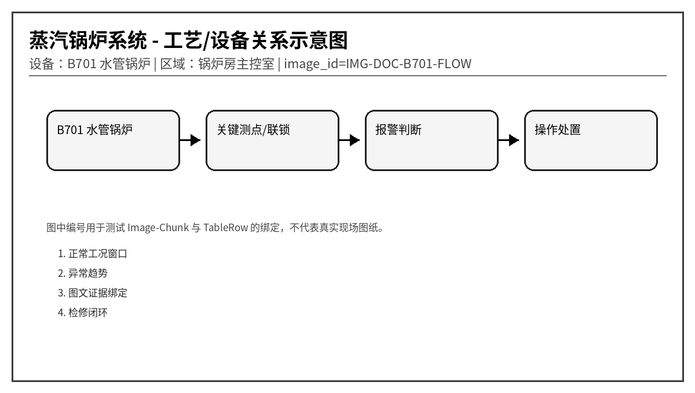
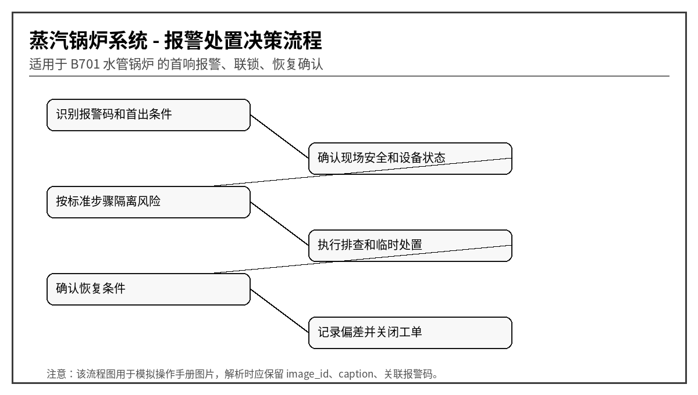

# B701 蒸汽锅炉安全联锁与报警处置规程
文档编号：DOC-B701  
版本：V1.0-模拟语料  
系统：蒸汽锅炉系统  
设备：B701 水管锅炉  
区域：锅炉房主控室
> 说明：本文档为模拟语料，用于知识库 Agent、RAG、GraphRAG、表格解析、图片绑定和报警处置问答测试，不代表真实装置操作票。
## 1. 适用范围与系统边界
本文档模拟锅炉汽包液位、炉膛压力、燃烧、给水、蒸汽压力、氧量和安全阀动作处理。强调安全联锁和禁止误操作。

## 2. 正常运行窗口
| 位号 | 参数 | 单位 | 正常范围 | 说明 |
|---|---|---|---|---|
| B701_LVL | 汽包液位 | mm | -50 ~ +50 | 低低联锁危险 |
| B701_STP | 主蒸汽压力 | MPa | 1.0 ~ 1.25 | 高压需降负荷 |
| B701_FURP | 炉膛压力 | Pa | -50 ~ -10 | 正压危险 |
| B701_O2 | 烟气氧量 | % | 3 ~ 6 | 低氧不完全燃烧 |
| B701_FWF | 给水流量 | t/h | 按负荷匹配 | 流量低易缺水 |

## 3. 报警总览表
| alarm_code | 报警名称 | 等级 | 触发位号 | 触发条件 | 关联图片ID |
|---|---|---|---|---|---|
| B701-A001 | 汽包液位高 | 高 | B701_LVL | 液位 > +120 mm 持续 10 s | LVH |
| B701-A002 | 汽包液位低 | 高高 | B701_LVL | 液位 < -120 mm 持续 5 s | LVL |
| B701-A003 | 炉膛压力高 | 高高 | B701_FURP | 炉膛压力 > +20 Pa 持续 3 s | FURP |
| B701-A004 | 火焰丧失 | 高高 | B701_FLAME | 任一主火焰检测丢失 | FLAME |
| B701-A005 | 给水流量低 | 高 | B701_FWF | 给水流量低于负荷需求 20% | FWF |
| B701-A006 | 蒸汽压力高 | 高 | B701_STP | 压力 > 1.32 MPa 持续 10 s | STP |
| B701-A007 | 燃烧管理系统跳闸 | 高高 | B701_BMS | BMS Trip 输出动作 | BMS |
| B701-A008 | 烟气氧量低 | 中 | B701_O2 | O2 < 2.0% 持续 60 s | O2 |
| B701-A009 | 省煤器出口温度高 | 中 | B701_ECO_T | 温度 > 180℃ 持续 5 min | ECO |
| B701-A010 | 安全阀动作 | 高高 | B701_SV | 安全阀开启反馈或现场确认 | SV |

## 4. 逐项报警处置卡

### 4.1 B701-A001 汽包液位高
- chunk_id：DOC-B701-CH-001
- row_id：DOC-B701-TALARM-R001
- 触发位号：B701_LVL
- 触发条件：液位 > +120 mm 持续 10 s
- 严重等级：高
- 关联图片：LVH

**可能原因：**
1. 给水调节阀卡开
1. 负荷骤降导致虚假水位
1. 液位计堵塞
1. 三冲量控制异常

**标准操作步骤：**
1. 降低给水阀开度
2. 核对双色水位计
3. 避免立即大幅排污
4. 确认蒸汽负荷变化

**恢复条件：** 液位回到 +50 mm 内。

**GraphRAG 建议三元组：**
- (:Alarm {code:'B701-A001'})-[:BELONGS_TO]->(:Device {name:'B701 水管锅炉'})
- (:Alarm {code:'B701-A001'})-[:HAS_ACTION]->(:Action {text:'降低给水阀开度'})
- (:TableRow {row_id:'DOC-B701-TALARM-R001'})-[:MENTIONS]->(:Alarm {code:'B701-A001'})
- (:TableRow {row_id:'DOC-B701-TALARM-R001'})-[:HAS_IMAGE]->(:Image {image_id:'LVH'})

### 4.2 B701-A002 汽包液位低
- chunk_id：DOC-B701-CH-002
- row_id：DOC-B701-TALARM-R002
- 触发位号：B701_LVL
- 触发条件：液位 < -120 mm 持续 5 s
- 严重等级：高高
- 关联图片：LVL

**可能原因：**
1. 给水泵故障
1. 给水阀关闭
1. 排污阀未关
1. 负荷骤升虚假低水位

**标准操作步骤：**
1. 立即增加给水并核对真实水位
2. 低低联锁后按规程停炉
3. 严禁缺水后盲目上水
4. 通知班长现场确认

**恢复条件：** 真实水位恢复且无过热风险。

**GraphRAG 建议三元组：**
- (:Alarm {code:'B701-A002'})-[:BELONGS_TO]->(:Device {name:'B701 水管锅炉'})
- (:Alarm {code:'B701-A002'})-[:HAS_ACTION]->(:Action {text:'立即增加给水并核对真实水位'})
- (:TableRow {row_id:'DOC-B701-TALARM-R002'})-[:MENTIONS]->(:Alarm {code:'B701-A002'})
- (:TableRow {row_id:'DOC-B701-TALARM-R002'})-[:HAS_IMAGE]->(:Image {image_id:'LVL'})

### 4.3 B701-A003 炉膛压力高
- chunk_id：DOC-B701-CH-003
- row_id：DOC-B701-TALARM-R003
- 触发位号：B701_FURP
- 触发条件：炉膛压力 > +20 Pa 持续 3 s
- 严重等级：高高
- 关联图片：FURP

**可能原因：**
1. 引风机跳停
1. 烟道挡板关闭
1. 燃烧风配比异常
1. 炉膛爆燃

**标准操作步骤：**
1. 立即降低燃料
2. 确认引风机和挡板
3. 人员远离炉门看火孔
4. 必要时执行 MFT

**恢复条件：** 炉膛负压恢复。

**GraphRAG 建议三元组：**
- (:Alarm {code:'B701-A003'})-[:BELONGS_TO]->(:Device {name:'B701 水管锅炉'})
- (:Alarm {code:'B701-A003'})-[:HAS_ACTION]->(:Action {text:'立即降低燃料'})
- (:TableRow {row_id:'DOC-B701-TALARM-R003'})-[:MENTIONS]->(:Alarm {code:'B701-A003'})
- (:TableRow {row_id:'DOC-B701-TALARM-R003'})-[:HAS_IMAGE]->(:Image {image_id:'FURP'})

### 4.4 B701-A004 火焰丧失
- chunk_id：DOC-B701-CH-004
- row_id：DOC-B701-TALARM-R004
- 触发位号：B701_FLAME
- 触发条件：任一主火焰检测丢失
- 严重等级：高高
- 关联图片：FLAME

**可能原因：**
1. 燃料压力低
1. 点火器故障
1. 风量过大吹灭
1. 火检探头污染

**标准操作步骤：**
1. 立即执行燃料切断确认
2. 按吹扫程序重新点火
3. 清洁火检探头
4. 禁止未吹扫直接重启

**恢复条件：** 重新点火成功且火焰稳定。

**GraphRAG 建议三元组：**
- (:Alarm {code:'B701-A004'})-[:BELONGS_TO]->(:Device {name:'B701 水管锅炉'})
- (:Alarm {code:'B701-A004'})-[:HAS_ACTION]->(:Action {text:'立即执行燃料切断确认'})
- (:TableRow {row_id:'DOC-B701-TALARM-R004'})-[:MENTIONS]->(:Alarm {code:'B701-A004'})
- (:TableRow {row_id:'DOC-B701-TALARM-R004'})-[:HAS_IMAGE]->(:Image {image_id:'FLAME'})

### 4.5 B701-A005 给水流量低
- chunk_id：DOC-B701-CH-005
- row_id：DOC-B701-TALARM-R005
- 触发位号：B701_FWF
- 触发条件：给水流量低于负荷需求 20%
- 严重等级：高
- 关联图片：FWF

**可能原因：**
1. 给水泵汽蚀
1. 调节阀故障
1. 除氧器液位低
1. 流量计故障

**标准操作步骤：**
1. 检查给水泵出口压力
2. 切换备用泵
3. 降低锅炉负荷
4. 核对除氧器液位

**恢复条件：** 给水流量恢复匹配负荷。

**GraphRAG 建议三元组：**
- (:Alarm {code:'B701-A005'})-[:BELONGS_TO]->(:Device {name:'B701 水管锅炉'})
- (:Alarm {code:'B701-A005'})-[:HAS_ACTION]->(:Action {text:'检查给水泵出口压力'})
- (:TableRow {row_id:'DOC-B701-TALARM-R005'})-[:MENTIONS]->(:Alarm {code:'B701-A005'})
- (:TableRow {row_id:'DOC-B701-TALARM-R005'})-[:HAS_IMAGE]->(:Image {image_id:'FWF'})

### 4.6 B701-A006 蒸汽压力高
- chunk_id：DOC-B701-CH-006
- row_id：DOC-B701-TALARM-R006
- 触发位号：B701_STP
- 触发条件：压力 > 1.32 MPa 持续 10 s
- 严重等级：高
- 关联图片：STP

**可能原因：**
1. 用汽量骤降
1. 燃料调节滞后
1. 主汽阀开度不足
1. 压力变送器偏差

**标准操作步骤：**
1. 降低燃料量
2. 打开合规旁路或通知用户增汽
3. 核对压力表
4. 安全阀动作时禁止强制压回

**恢复条件：** 压力 < 1.25 MPa。

**GraphRAG 建议三元组：**
- (:Alarm {code:'B701-A006'})-[:BELONGS_TO]->(:Device {name:'B701 水管锅炉'})
- (:Alarm {code:'B701-A006'})-[:HAS_ACTION]->(:Action {text:'降低燃料量'})
- (:TableRow {row_id:'DOC-B701-TALARM-R006'})-[:MENTIONS]->(:Alarm {code:'B701-A006'})
- (:TableRow {row_id:'DOC-B701-TALARM-R006'})-[:HAS_IMAGE]->(:Image {image_id:'STP'})

### 4.7 B701-A007 燃烧管理系统跳闸
- chunk_id：DOC-B701-CH-007
- row_id：DOC-B701-TALARM-R007
- 触发位号：B701_BMS
- 触发条件：BMS Trip 输出动作
- 严重等级：高高
- 关联图片：BMS

**可能原因：**
1. 任一硬联锁触发
1. 燃气阀检漏失败
1. 吹扫条件不满足
1. 控制柜故障

**标准操作步骤：**
1. 读取首出原因
2. 确认燃料切断阀关闭
3. 按规程完成吹扫
4. 未查明原因不得复位

**恢复条件：** 首出原因处理并完成吹扫。

**GraphRAG 建议三元组：**
- (:Alarm {code:'B701-A007'})-[:BELONGS_TO]->(:Device {name:'B701 水管锅炉'})
- (:Alarm {code:'B701-A007'})-[:HAS_ACTION]->(:Action {text:'读取首出原因'})
- (:TableRow {row_id:'DOC-B701-TALARM-R007'})-[:MENTIONS]->(:Alarm {code:'B701-A007'})
- (:TableRow {row_id:'DOC-B701-TALARM-R007'})-[:HAS_IMAGE]->(:Image {image_id:'BMS'})

### 4.8 B701-A008 烟气氧量低
- chunk_id：DOC-B701-CH-008
- row_id：DOC-B701-TALARM-R008
- 触发位号：B701_O2
- 触发条件：O2 < 2.0% 持续 60 s
- 严重等级：中
- 关联图片：O2

**可能原因：**
1. 送风量不足
1. 燃料过量
1. 氧量探头漂移
1. 烟道漏风导致控制误判

**标准操作步骤：**
1. 增加送风或降低燃料
2. 检查风门开度
3. 比对便携式烟气分析仪
4. 清洁氧探头

**恢复条件：** O2 回到 3% 以上。

**GraphRAG 建议三元组：**
- (:Alarm {code:'B701-A008'})-[:BELONGS_TO]->(:Device {name:'B701 水管锅炉'})
- (:Alarm {code:'B701-A008'})-[:HAS_ACTION]->(:Action {text:'增加送风或降低燃料'})
- (:TableRow {row_id:'DOC-B701-TALARM-R008'})-[:MENTIONS]->(:Alarm {code:'B701-A008'})
- (:TableRow {row_id:'DOC-B701-TALARM-R008'})-[:HAS_IMAGE]->(:Image {image_id:'O2'})

### 4.9 B701-A009 省煤器出口温度高
- chunk_id：DOC-B701-CH-009
- row_id：DOC-B701-TALARM-R009
- 触发位号：B701_ECO_T
- 触发条件：温度 > 180℃ 持续 5 min
- 严重等级：中
- 关联图片：ECO

**可能原因：**
1. 给水流量低
1. 烟气温度高
1. 省煤器结垢
1. 测温点漂移

**标准操作步骤：**
1. 检查给水流量
2. 降低燃烧负荷
3. 安排清灰和水侧检查
4. 校验温度点

**恢复条件：** 温度 < 165℃。

**GraphRAG 建议三元组：**
- (:Alarm {code:'B701-A009'})-[:BELONGS_TO]->(:Device {name:'B701 水管锅炉'})
- (:Alarm {code:'B701-A009'})-[:HAS_ACTION]->(:Action {text:'检查给水流量'})
- (:TableRow {row_id:'DOC-B701-TALARM-R009'})-[:MENTIONS]->(:Alarm {code:'B701-A009'})
- (:TableRow {row_id:'DOC-B701-TALARM-R009'})-[:HAS_IMAGE]->(:Image {image_id:'ECO'})

### 4.10 B701-A010 安全阀动作
- chunk_id：DOC-B701-CH-010
- row_id：DOC-B701-TALARM-R010
- 触发位号：B701_SV
- 触发条件：安全阀开启反馈或现场确认
- 严重等级：高高
- 关联图片：SV

**可能原因：**
1. 蒸汽压力超过整定值
1. 安全阀误动作
1. 压力控制失败
1. 用汽系统阀门关闭

**标准操作步骤：**
1. 立即降低燃料和压力
2. 人员远离排汽方向
3. 记录动作压力和回座压力
4. 动作后安排校验

**恢复条件：** 安全阀回座且压力正常。

**GraphRAG 建议三元组：**
- (:Alarm {code:'B701-A010'})-[:BELONGS_TO]->(:Device {name:'B701 水管锅炉'})
- (:Alarm {code:'B701-A010'})-[:HAS_ACTION]->(:Action {text:'立即降低燃料和压力'})
- (:TableRow {row_id:'DOC-B701-TALARM-R010'})-[:MENTIONS]->(:Alarm {code:'B701-A010'})
- (:TableRow {row_id:'DOC-B701-TALARM-R010'})-[:HAS_IMAGE]->(:Image {image_id:'SV'})

## 5. 易混淆报警与反例
- 同样是“压力高”，若伴随电流高，优先考虑负荷/阀位；若就地表正常而 DCS 偏高，优先考虑仪表导压或传感器。
- 同样是“振动高”，若吸入口压力低或流量波动，优先考虑汽蚀；若 1X 转频主导，优先考虑不平衡；若高频包络谱特征明显，优先考虑轴承故障。
- 对于高高联锁报警，回答中必须体现“先确认安全，再恢复生产”，不能只给重启步骤。

## 6. 班组交接记录模板
| 时间 | 报警码 | 首出/伴随报警 | 已执行操作 | 当前状态 | 交接人 |
|---|---|---|---|---|---|
| 2026-05-28 09:10 | 示例 | 示例 | 示例 | 示例 | 示例 |
