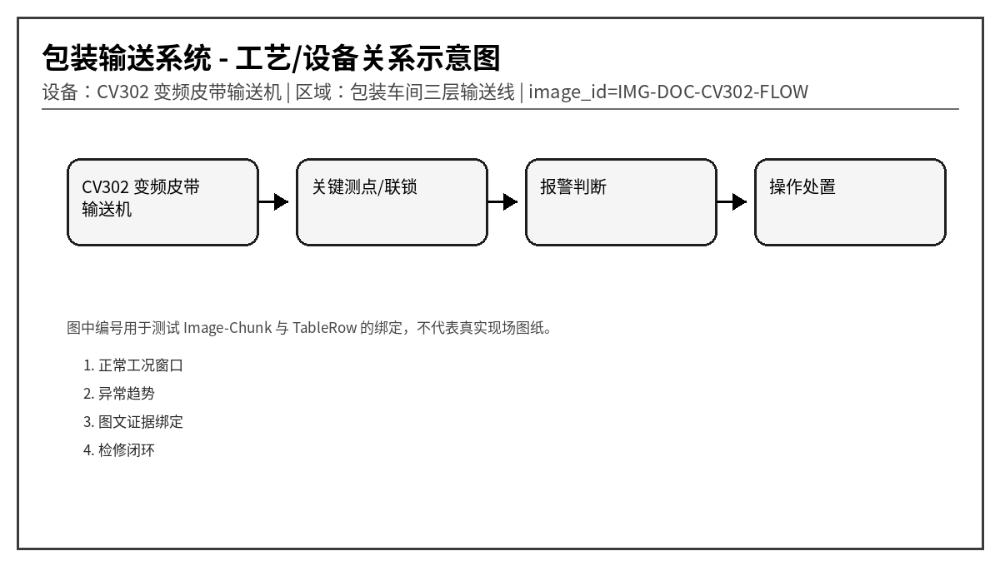
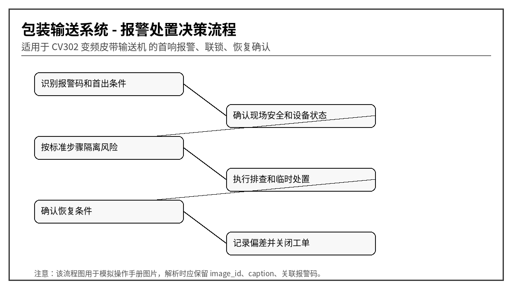

# CV302 皮带输送机与变频器异常报警处理手册
文档编号：DOC-CV302  
版本：V1.0-模拟语料  
系统：包装输送系统  
设备：CV302 变频皮带输送机  
区域：包装车间三层输送线
> 说明：本文档为模拟语料，用于知识库 Agent、RAG、GraphRAG、表格解析、图片绑定和报警处置问答测试，不代表真实装置操作票。
## 1. 适用范围与系统边界
输送机系统涉及变频器、拉绳急停、跑偏开关、零速开关、编码器、制动器和除尘联锁。本文档用于测试机械、电气、仪表混合故障的 GraphRAG 检索。

## 2. 正常运行窗口
| 位号 | 参数 | 单位 | 正常范围 | 说明 |
|---|---|---|---|---|
| CV302_SPD | 皮带速度 | m/s | 0.8 ~ 1.2 | 低速可能堵料 |
| CV302_VFDI | 变频器电流 | A | < 额定 100% | 过流检查卡滞 |
| CV302_ALIGN | 跑偏开关 | 0/1 | 0 正常 | 1 表示跑偏 |
| CV302_ZSS | 零速开关 | Hz | > 0.2 | 反馈丢失需停机 |
| CV302_BRK | 制动器反馈 | 0/1 | 运行时释放 | 未释放会过流 |

## 3. 报警总览表
| alarm_code | 报警名称 | 等级 | 触发位号 | 触发条件 | 关联图片ID |
|---|---|---|---|---|---|
| CV302-A001 | 皮带速度低 | 中 | CV302_SPD | 速度 < 0.65 m/s 持续 15 s | SPD |
| CV302-A002 | 变频器过流 | 高 | CV302_VFDI | 电流 > 额定 130% 持续 3 s | VFD |
| CV302-A003 | 皮带跑偏 | 高 | CV302_ALIGN | 任一跑偏开关动作超过 5 s | ALIGN |
| CV302-A004 | 电机轴承温度高 | 中 | CV302_MBT | 温度 > 85℃ 持续 60 s | MBT |
| CV302-A005 | 拉绳急停动作 | 高高 | CV302_PULL | 拉绳开关回路断开 | PULL |
| CV302-A006 | 溜槽堵料 | 高 | CV302_CHUTE | 堵料开关动作超过 10 s | CHUTE |
| CV302-A007 | 零速开关故障 | 中 | CV302_ZSS | 运行命令存在但零速反馈为 0 | ZSS |
| CV302-A008 | 编码器信号丢失 | 中 | CV302_ENC | 编码器脉冲 5 s 无变化 | ENC |
| CV302-A009 | 制动器释放失败 | 高 | CV302_BRK | 启动命令后制动器未释放 | BRK |
| CV302-A010 | 除尘联锁未满足 | 中 | CV302_DUST | 除尘风机未运行或压差异常 | DUST |

## 4. 逐项报警处置卡

### 4.1 CV302-A001 皮带速度低
- chunk_id：DOC-CV302-CH-001
- row_id：DOC-CV302-TALARM-R001
- 触发位号：CV302_SPD
- 触发条件：速度 < 0.65 m/s 持续 15 s
- 严重等级：中
- 关联图片：SPD

**可能原因：**
1. 皮带打滑
1. 负载过重
1. 变频器限频
1. 滚筒包胶磨损

**标准操作步骤：**
1. 检查皮带张紧和滚筒积料
2. 降低给料量
3. 查看 VFD 输出频率
4. 必要时停机清理

**恢复条件：** 速度恢复到 0.8 m/s 以上。

**GraphRAG 建议三元组：**
- (:Alarm {code:'CV302-A001'})-[:BELONGS_TO]->(:Device {name:'CV302 变频皮带输送机'})
- (:Alarm {code:'CV302-A001'})-[:HAS_ACTION]->(:Action {text:'检查皮带张紧和滚筒积料'})
- (:TableRow {row_id:'DOC-CV302-TALARM-R001'})-[:MENTIONS]->(:Alarm {code:'CV302-A001'})
- (:TableRow {row_id:'DOC-CV302-TALARM-R001'})-[:HAS_IMAGE]->(:Image {image_id:'SPD'})

### 4.2 CV302-A002 变频器过流
- chunk_id：DOC-CV302-CH-002
- row_id：DOC-CV302-TALARM-R002
- 触发位号：CV302_VFDI
- 触发条件：电流 > 额定 130% 持续 3 s
- 严重等级：高
- 关联图片：VFD

**可能原因：**
1. 下游堵料导致负载升高
1. 制动器未释放
1. 电机轴承卡涩
1. 加速时间过短

**标准操作步骤：**
1. 立即停止上游给料
2. 检查制动器反馈
3. 查看 VFD 故障代码
4. 复位前盘车确认无卡阻

**恢复条件：** 故障复位后空载运行电流正常。

**GraphRAG 建议三元组：**
- (:Alarm {code:'CV302-A002'})-[:BELONGS_TO]->(:Device {name:'CV302 变频皮带输送机'})
- (:Alarm {code:'CV302-A002'})-[:HAS_ACTION]->(:Action {text:'立即停止上游给料'})
- (:TableRow {row_id:'DOC-CV302-TALARM-R002'})-[:MENTIONS]->(:Alarm {code:'CV302-A002'})
- (:TableRow {row_id:'DOC-CV302-TALARM-R002'})-[:HAS_IMAGE]->(:Image {image_id:'VFD'})

### 4.3 CV302-A003 皮带跑偏
- chunk_id：DOC-CV302-CH-003
- row_id：DOC-CV302-TALARM-R003
- 触发位号：CV302_ALIGN
- 触发条件：任一跑偏开关动作超过 5 s
- 严重等级：高
- 关联图片：ALIGN

**可能原因：**
1. 落料点偏斜
1. 托辊损坏
1. 皮带接头不正
1. 张紧装置两侧不均

**标准操作步骤：**
1. 停止给料但保留低速运行观察
2. 调整导料槽和落料点
3. 检查托辊转动
4. 严重跑偏时立即停机

**恢复条件：** 跑偏开关复位且空载试车正常。

**GraphRAG 建议三元组：**
- (:Alarm {code:'CV302-A003'})-[:BELONGS_TO]->(:Device {name:'CV302 变频皮带输送机'})
- (:Alarm {code:'CV302-A003'})-[:HAS_ACTION]->(:Action {text:'停止给料但保留低速运行观察'})
- (:TableRow {row_id:'DOC-CV302-TALARM-R003'})-[:MENTIONS]->(:Alarm {code:'CV302-A003'})
- (:TableRow {row_id:'DOC-CV302-TALARM-R003'})-[:HAS_IMAGE]->(:Image {image_id:'ALIGN'})

### 4.4 CV302-A004 电机轴承温度高
- chunk_id：DOC-CV302-CH-004
- row_id：DOC-CV302-TALARM-R004
- 触发位号：CV302_MBT
- 触发条件：温度 > 85℃ 持续 60 s
- 严重等级：中
- 关联图片：MBT

**可能原因：**
1. 润滑不足
1. 粉尘进入轴承
1. 轴承游隙异常
1. 环境散热差

**标准操作步骤：**
1. 红外测温复核
2. 检查润滑周期
3. 降低负载观察趋势
4. 准备检修更换轴承

**恢复条件：** 温度低于 75℃。

**GraphRAG 建议三元组：**
- (:Alarm {code:'CV302-A004'})-[:BELONGS_TO]->(:Device {name:'CV302 变频皮带输送机'})
- (:Alarm {code:'CV302-A004'})-[:HAS_ACTION]->(:Action {text:'红外测温复核'})
- (:TableRow {row_id:'DOC-CV302-TALARM-R004'})-[:MENTIONS]->(:Alarm {code:'CV302-A004'})
- (:TableRow {row_id:'DOC-CV302-TALARM-R004'})-[:HAS_IMAGE]->(:Image {image_id:'MBT'})

### 4.5 CV302-A005 拉绳急停动作
- chunk_id：DOC-CV302-CH-005
- row_id：DOC-CV302-TALARM-R005
- 触发位号：CV302_PULL
- 触发条件：拉绳开关回路断开
- 严重等级：高高
- 关联图片：PULL

**可能原因：**
1. 现场人员拉停
1. 拉绳松弛
1. 开关进水
1. 检修未复位

**标准操作步骤：**
1. 确认人员安全
2. 沿线检查所有拉绳开关
3. 复位前通知中控
4. 记录动作位置

**恢复条件：** 所有拉绳开关复位并现场确认。

**GraphRAG 建议三元组：**
- (:Alarm {code:'CV302-A005'})-[:BELONGS_TO]->(:Device {name:'CV302 变频皮带输送机'})
- (:Alarm {code:'CV302-A005'})-[:HAS_ACTION]->(:Action {text:'确认人员安全'})
- (:TableRow {row_id:'DOC-CV302-TALARM-R005'})-[:MENTIONS]->(:Alarm {code:'CV302-A005'})
- (:TableRow {row_id:'DOC-CV302-TALARM-R005'})-[:HAS_IMAGE]->(:Image {image_id:'PULL'})

### 4.6 CV302-A006 溜槽堵料
- chunk_id：DOC-CV302-CH-006
- row_id：DOC-CV302-TALARM-R006
- 触发位号：CV302_CHUTE
- 触发条件：堵料开关动作超过 10 s
- 严重等级：高
- 关联图片：CHUTE

**可能原因：**
1. 下游皮带停机
1. 物料湿黏
1. 挡板开度异常
1. 除尘负压不足

**标准操作步骤：**
1. 立即停止上游给料
2. 确认下游设备状态
3. 清理堵料时执行挂牌
4. 恢复后低速试运行

**恢复条件：** 堵料开关复位且下游畅通。

**GraphRAG 建议三元组：**
- (:Alarm {code:'CV302-A006'})-[:BELONGS_TO]->(:Device {name:'CV302 变频皮带输送机'})
- (:Alarm {code:'CV302-A006'})-[:HAS_ACTION]->(:Action {text:'立即停止上游给料'})
- (:TableRow {row_id:'DOC-CV302-TALARM-R006'})-[:MENTIONS]->(:Alarm {code:'CV302-A006'})
- (:TableRow {row_id:'DOC-CV302-TALARM-R006'})-[:HAS_IMAGE]->(:Image {image_id:'CHUTE'})

### 4.7 CV302-A007 零速开关故障
- chunk_id：DOC-CV302-CH-007
- row_id：DOC-CV302-TALARM-R007
- 触发位号：CV302_ZSS
- 触发条件：运行命令存在但零速反馈为 0
- 严重等级：中
- 关联图片：ZSS

**可能原因：**
1. 探头间隙过大
1. 测速片脱落
1. 传感器供电异常
1. 接线松动

**标准操作步骤：**
1. 核对实际皮带是否转动
2. 检查传感器指示灯
3. 调整间隙
4. 必要时临时使用编码器速度判断

**恢复条件：** 零速反馈稳定。

**GraphRAG 建议三元组：**
- (:Alarm {code:'CV302-A007'})-[:BELONGS_TO]->(:Device {name:'CV302 变频皮带输送机'})
- (:Alarm {code:'CV302-A007'})-[:HAS_ACTION]->(:Action {text:'核对实际皮带是否转动'})
- (:TableRow {row_id:'DOC-CV302-TALARM-R007'})-[:MENTIONS]->(:Alarm {code:'CV302-A007'})
- (:TableRow {row_id:'DOC-CV302-TALARM-R007'})-[:HAS_IMAGE]->(:Image {image_id:'ZSS'})

### 4.8 CV302-A008 编码器信号丢失
- chunk_id：DOC-CV302-CH-008
- row_id：DOC-CV302-TALARM-R008
- 触发位号：CV302_ENC
- 触发条件：编码器脉冲 5 s 无变化
- 严重等级：中
- 关联图片：ENC

**可能原因：**
1. 编码器联轴器松动
1. 线缆断线
1. 粉尘污染码盘
1. 高速计数模块故障

**标准操作步骤：**
1. 检查编码器机械连接
2. 测量脉冲输入
3. 清洁编码器
4. 切换备用速度反馈

**恢复条件：** 脉冲恢复且速度显示连续。

**GraphRAG 建议三元组：**
- (:Alarm {code:'CV302-A008'})-[:BELONGS_TO]->(:Device {name:'CV302 变频皮带输送机'})
- (:Alarm {code:'CV302-A008'})-[:HAS_ACTION]->(:Action {text:'检查编码器机械连接'})
- (:TableRow {row_id:'DOC-CV302-TALARM-R008'})-[:MENTIONS]->(:Alarm {code:'CV302-A008'})
- (:TableRow {row_id:'DOC-CV302-TALARM-R008'})-[:HAS_IMAGE]->(:Image {image_id:'ENC'})

### 4.9 CV302-A009 制动器释放失败
- chunk_id：DOC-CV302-CH-009
- row_id：DOC-CV302-TALARM-R009
- 触发位号：CV302_BRK
- 触发条件：启动命令后制动器未释放
- 严重等级：高
- 关联图片：BRK

**可能原因：**
1. 制动线圈损坏
1. 制动器间隙过小
1. 整流模块故障
1. 反馈开关卡住

**标准操作步骤：**
1. 禁止反复强启
2. 测量制动线圈电压
3. 手动释放检查机械卡涩
4. 检修后重新校验反馈

**恢复条件：** 释放反馈正常。

**GraphRAG 建议三元组：**
- (:Alarm {code:'CV302-A009'})-[:BELONGS_TO]->(:Device {name:'CV302 变频皮带输送机'})
- (:Alarm {code:'CV302-A009'})-[:HAS_ACTION]->(:Action {text:'禁止反复强启'})
- (:TableRow {row_id:'DOC-CV302-TALARM-R009'})-[:MENTIONS]->(:Alarm {code:'CV302-A009'})
- (:TableRow {row_id:'DOC-CV302-TALARM-R009'})-[:HAS_IMAGE]->(:Image {image_id:'BRK'})

### 4.10 CV302-A010 除尘联锁未满足
- chunk_id：DOC-CV302-CH-010
- row_id：DOC-CV302-TALARM-R010
- 触发位号：CV302_DUST
- 触发条件：除尘风机未运行或压差异常
- 严重等级：中
- 关联图片：DUST

**可能原因：**
1. 除尘风机跳停
1. 滤袋堵塞
1. 压差开关故障
1. 联锁旁路未关闭

**标准操作步骤：**
1. 先启动除尘系统
2. 确认压差在允许范围
3. 禁止无除尘长期输送粉料
4. 检查联锁旁路状态

**恢复条件：** 除尘运行且压差正常。

**GraphRAG 建议三元组：**
- (:Alarm {code:'CV302-A010'})-[:BELONGS_TO]->(:Device {name:'CV302 变频皮带输送机'})
- (:Alarm {code:'CV302-A010'})-[:HAS_ACTION]->(:Action {text:'先启动除尘系统'})
- (:TableRow {row_id:'DOC-CV302-TALARM-R010'})-[:MENTIONS]->(:Alarm {code:'CV302-A010'})
- (:TableRow {row_id:'DOC-CV302-TALARM-R010'})-[:HAS_IMAGE]->(:Image {image_id:'DUST'})

## 5. 易混淆报警与反例
- 同样是“压力高”，若伴随电流高，优先考虑负荷/阀位；若就地表正常而 DCS 偏高，优先考虑仪表导压或传感器。
- 同样是“振动高”，若吸入口压力低或流量波动，优先考虑汽蚀；若 1X 转频主导，优先考虑不平衡；若高频包络谱特征明显，优先考虑轴承故障。
- 对于高高联锁报警，回答中必须体现“先确认安全，再恢复生产”，不能只给重启步骤。

## 6. 班组交接记录模板
| 时间 | 报警码 | 首出/伴随报警 | 已执行操作 | 当前状态 | 交接人 |
|---|---|---|---|---|---|
| 2026-05-28 09:10 | 示例 | 示例 | 示例 | 示例 | 示例 |
