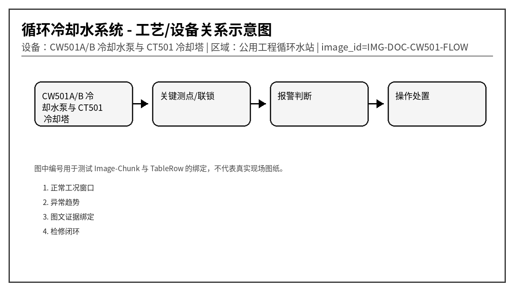
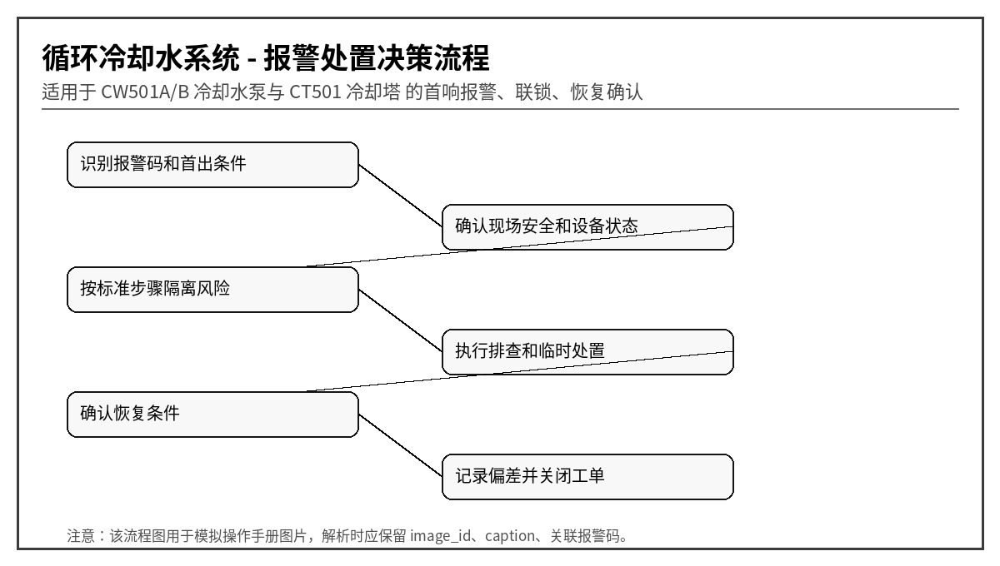

# CW501 冷却水泵站与冷却塔异常报警操作手册
文档编号：DOC-CW501  
版本：V1.0-模拟语料  
系统：循环冷却水系统  
设备：CW501A/B 冷却水泵与 CT501 冷却塔  
区域：公用工程循环水站
> 说明：本文档为模拟语料，用于知识库 Agent、RAG、GraphRAG、表格解析、图片绑定和报警处置问答测试，不代表真实装置操作票。
## 1. 适用范围与系统边界
本手册覆盖冷却水供应压力、回水温度、冷却塔风机、旁滤器、补水、水质、电导率和加药设备异常。适合测试设备-参数-报警-处理措施多跳关系。

## 2. 正常运行窗口
| 位号 | 参数 | 单位 | 正常范围 | 说明 |
|---|---|---|---|---|
| CW501_SP | 供水压力 | MPa | 0.32 ~ 0.48 | 低压影响全厂换热 |
| CW501_RT | 回水温度 | ℃ | < 36 | 高温说明换热或塔效率不足 |
| CW501_FLOW | 总供水流量 | m3/h | 850 ~ 1200 | 低流量需查泵和阀 |
| CW501_COND | 电导率 | μS/cm | < 2200 | 高值需排污 |
| CW501_BASIN | 塔盆液位 | % | 45 ~ 75 | 低液位泵易汽蚀 |

## 3. 报警总览表
| alarm_code | 报警名称 | 等级 | 触发位号 | 触发条件 | 关联图片ID |
|---|---|---|---|---|---|
| CW501-A001 | 供水压力低 | 高 | CW501_SP | 压力 < 0.28 MPa 持续 20 s | SP |
| CW501-A002 | 回水温度高 | 中 | CW501_RT | 回水温度 > 38℃ 持续 10 min | RT |
| CW501-A003 | 冷却塔风机跳停 | 高 | CT501_FAN | 运行命令存在但反馈为 0 | FAN |
| CW501-A004 | 冷却水泵振动高 | 高 | CW501_VIB | 振动 > 6.3 mm/s 持续 30 s | VIB |
| CW501-A005 | 旁滤器压差高 | 低 | CW501_FDP | 压差 > 80 kPa 持续 15 min | FDP |
| CW501-A006 | 补水液位低 | 高 | CW501_BASIN | 塔盆液位 < 35% 持续 60 s | BASIN |
| CW501-A007 | 电导率高 | 中 | CW501_COND | 电导率 > 2400 μS/cm 持续 30 min | COND |
| CW501-A008 | 加药泵故障 | 中 | CW501_CHEM | 加药泵运行反馈丢失 | CHEM |
| CW501-A009 | 塔盆液位高 | 中 | CW501_BASIN | 液位 > 85% 持续 120 s | HIGH |
| CW501-A010 | 流量分配异常 | 中 | CW501_FLOW_BAL | 支路流量偏差 > 25% | BAL |

## 4. 逐项报警处置卡

### 4.1 CW501-A001 供水压力低
- chunk_id：DOC-CW501-CH-001
- row_id：DOC-CW501-TALARM-R001
- 触发位号：CW501_SP
- 触发条件：压力 < 0.28 MPa 持续 20 s
- 严重等级：高
- 关联图片：SP

**可能原因：**
1. 运行泵跳停
1. 旁通阀误开
1. 塔盆液位低导致汽蚀
1. 总管泄漏

**标准操作步骤：**
1. 确认运行泵状态
2. 启动备用泵
3. 检查旁通阀和补水阀
4. 通知主要用户降低负荷

**恢复条件：** 压力 > 0.34 MPa。

**GraphRAG 建议三元组：**
- (:Alarm {code:'CW501-A001'})-[:BELONGS_TO]->(:Device {name:'CW501A/B 冷却水泵与 CT501 冷却塔'})
- (:Alarm {code:'CW501-A001'})-[:HAS_ACTION]->(:Action {text:'确认运行泵状态'})
- (:TableRow {row_id:'DOC-CW501-TALARM-R001'})-[:MENTIONS]->(:Alarm {code:'CW501-A001'})
- (:TableRow {row_id:'DOC-CW501-TALARM-R001'})-[:HAS_IMAGE]->(:Image {image_id:'SP'})

### 4.2 CW501-A002 回水温度高
- chunk_id：DOC-CW501-CH-002
- row_id：DOC-CW501-TALARM-R002
- 触发位号：CW501_RT
- 触发条件：回水温度 > 38℃ 持续 10 min
- 严重等级：中
- 关联图片：RT

**可能原因：**
1. 冷却塔风机停运
1. 环境湿球温度高
1. 换热器结垢
1. 循环量不足

**标准操作步骤：**
1. 增加风机台数
2. 确认塔填料布水均匀
3. 检查供水流量
4. 通知工艺侧评估降负荷

**恢复条件：** 回水温度 < 35℃。

**GraphRAG 建议三元组：**
- (:Alarm {code:'CW501-A002'})-[:BELONGS_TO]->(:Device {name:'CW501A/B 冷却水泵与 CT501 冷却塔'})
- (:Alarm {code:'CW501-A002'})-[:HAS_ACTION]->(:Action {text:'增加风机台数'})
- (:TableRow {row_id:'DOC-CW501-TALARM-R002'})-[:MENTIONS]->(:Alarm {code:'CW501-A002'})
- (:TableRow {row_id:'DOC-CW501-TALARM-R002'})-[:HAS_IMAGE]->(:Image {image_id:'RT'})

### 4.3 CW501-A003 冷却塔风机跳停
- chunk_id：DOC-CW501-CH-003
- row_id：DOC-CW501-TALARM-R003
- 触发位号：CT501_FAN
- 触发条件：运行命令存在但反馈为 0
- 严重等级：高
- 关联图片：FAN

**可能原因：**
1. 电机保护动作
1. 振动开关动作
1. 皮带断裂
1. 变频器故障

**标准操作步骤：**
1. 查看电气故障码
2. 检查风机振动和皮带
3. 切换备用风机
4. 高温天气优先恢复冷却能力

**恢复条件：** 风机运行反馈正常。

**GraphRAG 建议三元组：**
- (:Alarm {code:'CW501-A003'})-[:BELONGS_TO]->(:Device {name:'CW501A/B 冷却水泵与 CT501 冷却塔'})
- (:Alarm {code:'CW501-A003'})-[:HAS_ACTION]->(:Action {text:'查看电气故障码'})
- (:TableRow {row_id:'DOC-CW501-TALARM-R003'})-[:MENTIONS]->(:Alarm {code:'CW501-A003'})
- (:TableRow {row_id:'DOC-CW501-TALARM-R003'})-[:HAS_IMAGE]->(:Image {image_id:'FAN'})

### 4.4 CW501-A004 冷却水泵振动高
- chunk_id：DOC-CW501-CH-004
- row_id：DOC-CW501-TALARM-R004
- 触发位号：CW501_VIB
- 触发条件：振动 > 6.3 mm/s 持续 30 s
- 严重等级：高
- 关联图片：VIB

**可能原因：**
1. 汽蚀
1. 轴承损伤
1. 叶轮不平衡
1. 基础松动

**标准操作步骤：**
1. 检查塔盆液位和吸入口压力
2. 现场听诊
3. 采集频谱
4. 超限严重时切泵

**恢复条件：** 振动 < 4.5 mm/s。

**GraphRAG 建议三元组：**
- (:Alarm {code:'CW501-A004'})-[:BELONGS_TO]->(:Device {name:'CW501A/B 冷却水泵与 CT501 冷却塔'})
- (:Alarm {code:'CW501-A004'})-[:HAS_ACTION]->(:Action {text:'检查塔盆液位和吸入口压力'})
- (:TableRow {row_id:'DOC-CW501-TALARM-R004'})-[:MENTIONS]->(:Alarm {code:'CW501-A004'})
- (:TableRow {row_id:'DOC-CW501-TALARM-R004'})-[:HAS_IMAGE]->(:Image {image_id:'VIB'})

### 4.5 CW501-A005 旁滤器压差高
- chunk_id：DOC-CW501-CH-005
- row_id：DOC-CW501-TALARM-R005
- 触发位号：CW501_FDP
- 触发条件：压差 > 80 kPa 持续 15 min
- 严重等级：低
- 关联图片：FDP

**可能原因：**
1. 滤网堵塞
1. 反洗失败
1. 入口阀未全开
1. 压差表堵塞

**标准操作步骤：**
1. 启动反洗程序
2. 切换旁滤器支路
3. 检查反洗排水是否畅通
4. 维护压差取压口

**恢复条件：** 压差 < 45 kPa。

**GraphRAG 建议三元组：**
- (:Alarm {code:'CW501-A005'})-[:BELONGS_TO]->(:Device {name:'CW501A/B 冷却水泵与 CT501 冷却塔'})
- (:Alarm {code:'CW501-A005'})-[:HAS_ACTION]->(:Action {text:'启动反洗程序'})
- (:TableRow {row_id:'DOC-CW501-TALARM-R005'})-[:MENTIONS]->(:Alarm {code:'CW501-A005'})
- (:TableRow {row_id:'DOC-CW501-TALARM-R005'})-[:HAS_IMAGE]->(:Image {image_id:'FDP'})

### 4.6 CW501-A006 补水液位低
- chunk_id：DOC-CW501-CH-006
- row_id：DOC-CW501-TALARM-R006
- 触发位号：CW501_BASIN
- 触发条件：塔盆液位 < 35% 持续 60 s
- 严重等级：高
- 关联图片：BASIN

**可能原因：**
1. 补水阀故障
1. 补水总管压力低
1. 排污阀未关严
1. 泄漏

**标准操作步骤：**
1. 打开备用补水
2. 检查排污阀
3. 降低循环泵负荷防汽蚀
4. 巡检塔盆泄漏

**恢复条件：** 液位 > 50%。

**GraphRAG 建议三元组：**
- (:Alarm {code:'CW501-A006'})-[:BELONGS_TO]->(:Device {name:'CW501A/B 冷却水泵与 CT501 冷却塔'})
- (:Alarm {code:'CW501-A006'})-[:HAS_ACTION]->(:Action {text:'打开备用补水'})
- (:TableRow {row_id:'DOC-CW501-TALARM-R006'})-[:MENTIONS]->(:Alarm {code:'CW501-A006'})
- (:TableRow {row_id:'DOC-CW501-TALARM-R006'})-[:HAS_IMAGE]->(:Image {image_id:'BASIN'})

### 4.7 CW501-A007 电导率高
- chunk_id：DOC-CW501-CH-007
- row_id：DOC-CW501-TALARM-R007
- 触发位号：CW501_COND
- 触发条件：电导率 > 2400 μS/cm 持续 30 min
- 严重等级：中
- 关联图片：COND

**可能原因：**
1. 浓缩倍数过高
1. 排污阀未动作
1. 补水水质异常
1. 电导率探头污染

**标准操作步骤：**
1. 启动排污
2. 确认补水水质
3. 清洗探头
4. 加密水质化验

**恢复条件：** 电导率 < 2100 μS/cm。

**GraphRAG 建议三元组：**
- (:Alarm {code:'CW501-A007'})-[:BELONGS_TO]->(:Device {name:'CW501A/B 冷却水泵与 CT501 冷却塔'})
- (:Alarm {code:'CW501-A007'})-[:HAS_ACTION]->(:Action {text:'启动排污'})
- (:TableRow {row_id:'DOC-CW501-TALARM-R007'})-[:MENTIONS]->(:Alarm {code:'CW501-A007'})
- (:TableRow {row_id:'DOC-CW501-TALARM-R007'})-[:HAS_IMAGE]->(:Image {image_id:'COND'})

### 4.8 CW501-A008 加药泵故障
- chunk_id：DOC-CW501-CH-008
- row_id：DOC-CW501-TALARM-R008
- 触发位号：CW501_CHEM
- 触发条件：加药泵运行反馈丢失
- 严重等级：中
- 关联图片：CHEM

**可能原因：**
1. 药箱液位低
1. 隔膜破损
1. 出口单向阀堵塞
1. 电机故障

**标准操作步骤：**
1. 检查药箱液位
2. 切换备用加药泵
3. 检查出口压力
4. 记录未加药时间

**恢复条件：** 加药流量恢复。

**GraphRAG 建议三元组：**
- (:Alarm {code:'CW501-A008'})-[:BELONGS_TO]->(:Device {name:'CW501A/B 冷却水泵与 CT501 冷却塔'})
- (:Alarm {code:'CW501-A008'})-[:HAS_ACTION]->(:Action {text:'检查药箱液位'})
- (:TableRow {row_id:'DOC-CW501-TALARM-R008'})-[:MENTIONS]->(:Alarm {code:'CW501-A008'})
- (:TableRow {row_id:'DOC-CW501-TALARM-R008'})-[:HAS_IMAGE]->(:Image {image_id:'CHEM'})

### 4.9 CW501-A009 塔盆液位高
- chunk_id：DOC-CW501-CH-009
- row_id：DOC-CW501-TALARM-R009
- 触发位号：CW501_BASIN
- 触发条件：液位 > 85% 持续 120 s
- 严重等级：中
- 关联图片：HIGH

**可能原因：**
1. 补水阀内漏
1. 雨水进入塔盆
1. 液位计漂移
1. 溢流管堵塞

**标准操作步骤：**
1. 关闭补水阀观察
2. 检查溢流管
3. 比对现场液位
4. 校验液位计

**恢复条件：** 液位回到 65% 以下。

**GraphRAG 建议三元组：**
- (:Alarm {code:'CW501-A009'})-[:BELONGS_TO]->(:Device {name:'CW501A/B 冷却水泵与 CT501 冷却塔'})
- (:Alarm {code:'CW501-A009'})-[:HAS_ACTION]->(:Action {text:'关闭补水阀观察'})
- (:TableRow {row_id:'DOC-CW501-TALARM-R009'})-[:MENTIONS]->(:Alarm {code:'CW501-A009'})
- (:TableRow {row_id:'DOC-CW501-TALARM-R009'})-[:HAS_IMAGE]->(:Image {image_id:'HIGH'})

### 4.10 CW501-A010 流量分配异常
- chunk_id：DOC-CW501-CH-010
- row_id：DOC-CW501-TALARM-R010
- 触发位号：CW501_FLOW_BAL
- 触发条件：支路流量偏差 > 25%
- 严重等级：中
- 关联图片：BAL

**可能原因：**
1. 支路阀位不一致
1. 换热器堵塞
1. 流量计故障
1. 用户侧旁路打开

**标准操作步骤：**
1. 核对各支路阀位
2. 检查换热器进出口温差
3. 比对便携式流量计
4. 调整平衡阀

**恢复条件：** 支路偏差 < 10%。

**GraphRAG 建议三元组：**
- (:Alarm {code:'CW501-A010'})-[:BELONGS_TO]->(:Device {name:'CW501A/B 冷却水泵与 CT501 冷却塔'})
- (:Alarm {code:'CW501-A010'})-[:HAS_ACTION]->(:Action {text:'核对各支路阀位'})
- (:TableRow {row_id:'DOC-CW501-TALARM-R010'})-[:MENTIONS]->(:Alarm {code:'CW501-A010'})
- (:TableRow {row_id:'DOC-CW501-TALARM-R010'})-[:HAS_IMAGE]->(:Image {image_id:'BAL'})

## 5. 易混淆报警与反例
- 同样是“压力高”，若伴随电流高，优先考虑负荷/阀位；若就地表正常而 DCS 偏高，优先考虑仪表导压或传感器。
- 同样是“振动高”，若吸入口压力低或流量波动，优先考虑汽蚀；若 1X 转频主导，优先考虑不平衡；若高频包络谱特征明显，优先考虑轴承故障。
- 对于高高联锁报警，回答中必须体现“先确认安全，再恢复生产”，不能只给重启步骤。

## 6. 班组交接记录模板
| 时间 | 报警码 | 首出/伴随报警 | 已执行操作 | 当前状态 | 交接人 |
|---|---|---|---|---|---|
| 2026-05-28 09:10 | 示例 | 示例 | 示例 | 示例 | 示例 |
