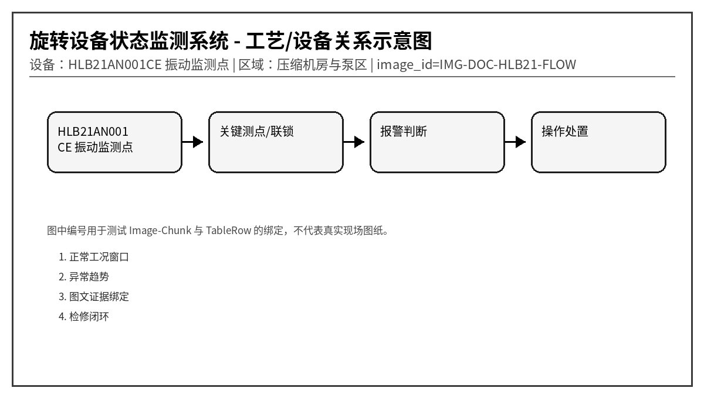
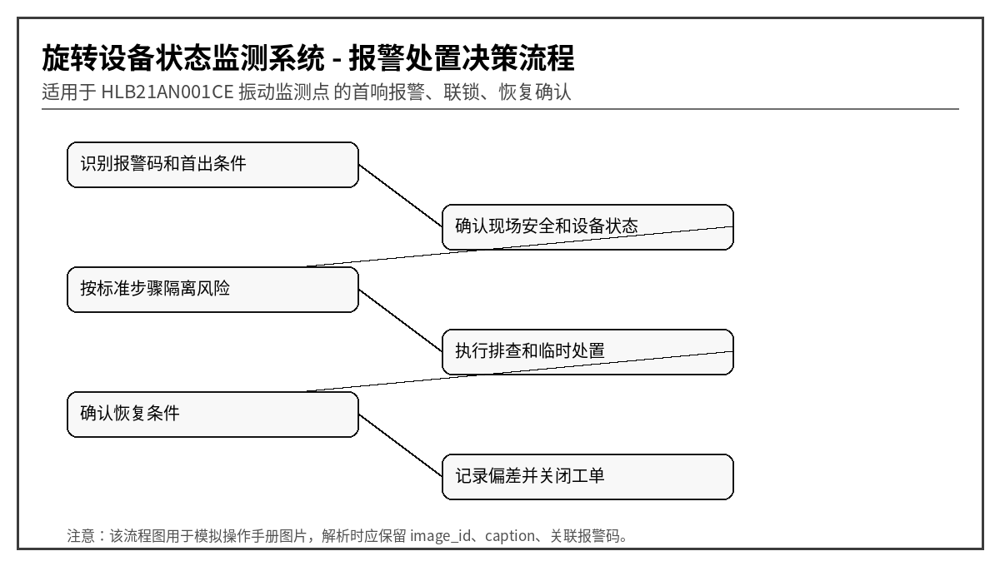

# HLB21 振动传感器轴承故障诊断与报警处理指南
文档编号：DOC-HLB21  
版本：V1.0-模拟语料  
系统：旋转设备状态监测系统  
设备：HLB21AN001CE 振动监测点  
区域：压缩机房与泵区
> 说明：本文档为模拟语料，用于知识库 Agent、RAG、GraphRAG、表格解析、图片绑定和报警处置问答测试，不代表真实装置操作票。
## 1. 适用范围与系统边界
本指南模拟轴承振动监测文档，覆盖时域 RMS、峰值、峭度、包络谱 BPFO/BPFI、1X 不平衡、2X 不对中、松动和传感器故障。适合测试工业数据分析 Agent 的工具调用与报告生成。

## 2. 正常运行窗口
| 位号 | 参数 | 单位 | 正常范围 | 说明 |
|---|---|---|---|---|
| HLB21_VRMS | 速度 RMS | mm/s | < 4.5 | ISO 趋势参考 |
| HLB21_APK | 加速度峰值 | g | < 6 | 冲击异常关注 |
| HLB21_KURT | 峭度 | - | < 4 | 早期轴承故障敏感 |
| HLB21_TEMP | 测点温度 | ℃ | < 80 | 温振耦合判断 |
| HLB21_SNR | 信号质量 | dB | > 18 | 低信噪比先查传感器 |

## 3. 报警总览表
| alarm_code | 报警名称 | 等级 | 触发位号 | 触发条件 | 关联图片ID |
|---|---|---|---|---|---|
| HLB21-A001 | 速度 RMS 高 | 中 | HLB21_VRMS | RMS > 5.0 mm/s 持续 10 min | RMS |
| HLB21-A002 | 加速度峰值高 | 中 | HLB21_APK | 峰值 > 8 g 持续 5 min | APK |
| HLB21-A003 | 包络谱外圈特征频率异常 | 高 | HLB21_ENV_BPFO | BPFO 幅值超过基线 3 倍 | BPFO |
| HLB21-A004 | 包络谱内圈特征频率异常 | 高 | HLB21_ENV_BPFI | BPFI 幅值超过基线 3 倍 | BPFI |
| HLB21-A005 | 疑似不对中 | 中 | HLB21_FFT_2X | 2X 转频幅值持续升高 | ALIGN |
| HLB21-A006 | 疑似不平衡 | 中 | HLB21_FFT_1X | 1X 转频主导且相位稳定 | UNBAL |
| HLB21-A007 | 机械松动特征 | 高 | HLB21_FFT_HARM | 多倍频和半频成分明显 | LOOSE |
| HLB21-A008 | 传感器线缆故障 | 低 | HLB21_SNR | 信噪比 < 12 dB 或信号断续 | CABLE |
| HLB21-A009 | 温度振动耦合升高 | 高 | HLB21_TEMP_VIB | 温度和 RMS 同时升高超过基线 | TV |
| HLB21-A010 | 趋势退化预警 | 中 | HLB21_TREND | 7 日滚动均值斜率超过阈值 | TREND |

## 4. 逐项报警处置卡

### 4.1 HLB21-A001 速度 RMS 高
- chunk_id：DOC-HLB21-CH-001
- row_id：DOC-HLB21-TALARM-R001
- 触发位号：HLB21_VRMS
- 触发条件：RMS > 5.0 mm/s 持续 10 min
- 严重等级：中
- 关联图片：RMS

**可能原因：**
1. 转子不平衡
1. 基础松动
1. 联轴器不对中
1. 工况流量偏离

**标准操作步骤：**
1. 查看趋势是否缓慢上升
2. 做 FFT 确认 1X/2X 成分
3. 现场检查地脚螺栓
4. 计划检修动平衡或对中

**恢复条件：** RMS < 4.0 mm/s。

**GraphRAG 建议三元组：**
- (:Alarm {code:'HLB21-A001'})-[:BELONGS_TO]->(:Device {name:'HLB21AN001CE 振动监测点'})
- (:Alarm {code:'HLB21-A001'})-[:HAS_ACTION]->(:Action {text:'查看趋势是否缓慢上升'})
- (:TableRow {row_id:'DOC-HLB21-TALARM-R001'})-[:MENTIONS]->(:Alarm {code:'HLB21-A001'})
- (:TableRow {row_id:'DOC-HLB21-TALARM-R001'})-[:HAS_IMAGE]->(:Image {image_id:'RMS'})

### 4.2 HLB21-A002 加速度峰值高
- chunk_id：DOC-HLB21-CH-002
- row_id：DOC-HLB21-TALARM-R002
- 触发位号：HLB21_APK
- 触发条件：峰值 > 8 g 持续 5 min
- 严重等级：中
- 关联图片：APK

**可能原因：**
1. 轴承滚动体冲击
1. 异物碰摩
1. 齿轮啮合冲击
1. 传感器安装松动

**标准操作步骤：**
1. 查看峰值因子和波形
2. 检查安装螺纹扭矩
3. 做包络谱分析
4. 必要时缩短巡检周期

**恢复条件：** 峰值 < 5 g。

**GraphRAG 建议三元组：**
- (:Alarm {code:'HLB21-A002'})-[:BELONGS_TO]->(:Device {name:'HLB21AN001CE 振动监测点'})
- (:Alarm {code:'HLB21-A002'})-[:HAS_ACTION]->(:Action {text:'查看峰值因子和波形'})
- (:TableRow {row_id:'DOC-HLB21-TALARM-R002'})-[:MENTIONS]->(:Alarm {code:'HLB21-A002'})
- (:TableRow {row_id:'DOC-HLB21-TALARM-R002'})-[:HAS_IMAGE]->(:Image {image_id:'APK'})

### 4.3 HLB21-A003 包络谱外圈特征频率异常
- chunk_id：DOC-HLB21-CH-003
- row_id：DOC-HLB21-TALARM-R003
- 触发位号：HLB21_ENV_BPFO
- 触发条件：BPFO 幅值超过基线 3 倍
- 严重等级：高
- 关联图片：BPFO

**可能原因：**
1. 轴承外圈剥落
1. 润滑污染
1. 载荷冲击
1. 安装座局部变形

**标准操作步骤：**
1. 复核轴承型号和特征频率
2. 采集高频加速度
3. 检查润滑脂污染
4. 安排停机开盖检查

**恢复条件：** BPFO 幅值回落或更换轴承后正常。

**GraphRAG 建议三元组：**
- (:Alarm {code:'HLB21-A003'})-[:BELONGS_TO]->(:Device {name:'HLB21AN001CE 振动监测点'})
- (:Alarm {code:'HLB21-A003'})-[:HAS_ACTION]->(:Action {text:'复核轴承型号和特征频率'})
- (:TableRow {row_id:'DOC-HLB21-TALARM-R003'})-[:MENTIONS]->(:Alarm {code:'HLB21-A003'})
- (:TableRow {row_id:'DOC-HLB21-TALARM-R003'})-[:HAS_IMAGE]->(:Image {image_id:'BPFO'})

### 4.4 HLB21-A004 包络谱内圈特征频率异常
- chunk_id：DOC-HLB21-CH-004
- row_id：DOC-HLB21-TALARM-R004
- 触发位号：HLB21_ENV_BPFI
- 触发条件：BPFI 幅值超过基线 3 倍
- 严重等级：高
- 关联图片：BPFI

**可能原因：**
1. 轴承内圈裂纹
1. 过盈配合异常
1. 轴电流损伤
1. 长期过载

**标准操作步骤：**
1. 核对转速修正后的 BPFI
2. 观察边带是否明显
3. 检查接地碳刷或轴电压
4. 准备更换轴承

**恢复条件：** BPFI 幅值低于报警线。

**GraphRAG 建议三元组：**
- (:Alarm {code:'HLB21-A004'})-[:BELONGS_TO]->(:Device {name:'HLB21AN001CE 振动监测点'})
- (:Alarm {code:'HLB21-A004'})-[:HAS_ACTION]->(:Action {text:'核对转速修正后的 BPFI'})
- (:TableRow {row_id:'DOC-HLB21-TALARM-R004'})-[:MENTIONS]->(:Alarm {code:'HLB21-A004'})
- (:TableRow {row_id:'DOC-HLB21-TALARM-R004'})-[:HAS_IMAGE]->(:Image {image_id:'BPFI'})

### 4.5 HLB21-A005 疑似不对中
- chunk_id：DOC-HLB21-CH-005
- row_id：DOC-HLB21-TALARM-R005
- 触发位号：HLB21_FFT_2X
- 触发条件：2X 转频幅值持续升高
- 严重等级：中
- 关联图片：ALIGN

**可能原因：**
1. 联轴器对中超差
1. 热膨胀补偿不足
1. 软脚
1. 管道应力

**标准操作步骤：**
1. 检查 1X 与 2X 比例
2. 进行激光对中
3. 检查软脚和管道应力
4. 对中后建立新基线

**恢复条件：** 2X 幅值下降到基线 1.5 倍以内。

**GraphRAG 建议三元组：**
- (:Alarm {code:'HLB21-A005'})-[:BELONGS_TO]->(:Device {name:'HLB21AN001CE 振动监测点'})
- (:Alarm {code:'HLB21-A005'})-[:HAS_ACTION]->(:Action {text:'检查 1X 与 2X 比例'})
- (:TableRow {row_id:'DOC-HLB21-TALARM-R005'})-[:MENTIONS]->(:Alarm {code:'HLB21-A005'})
- (:TableRow {row_id:'DOC-HLB21-TALARM-R005'})-[:HAS_IMAGE]->(:Image {image_id:'ALIGN'})

### 4.6 HLB21-A006 疑似不平衡
- chunk_id：DOC-HLB21-CH-006
- row_id：DOC-HLB21-TALARM-R006
- 触发位号：HLB21_FFT_1X
- 触发条件：1X 转频主导且相位稳定
- 严重等级：中
- 关联图片：UNBAL

**可能原因：**
1. 叶轮积灰
1. 转子磨损
1. 联轴器配重脱落
1. 介质结垢

**标准操作步骤：**
1. 确认相位是否稳定
2. 检查叶轮和联轴器
3. 清理积灰后复测
4. 必要时做现场动平衡

**恢复条件：** 1X 幅值恢复。

**GraphRAG 建议三元组：**
- (:Alarm {code:'HLB21-A006'})-[:BELONGS_TO]->(:Device {name:'HLB21AN001CE 振动监测点'})
- (:Alarm {code:'HLB21-A006'})-[:HAS_ACTION]->(:Action {text:'确认相位是否稳定'})
- (:TableRow {row_id:'DOC-HLB21-TALARM-R006'})-[:MENTIONS]->(:Alarm {code:'HLB21-A006'})
- (:TableRow {row_id:'DOC-HLB21-TALARM-R006'})-[:HAS_IMAGE]->(:Image {image_id:'UNBAL'})

### 4.7 HLB21-A007 机械松动特征
- chunk_id：DOC-HLB21-CH-007
- row_id：DOC-HLB21-TALARM-R007
- 触发位号：HLB21_FFT_HARM
- 触发条件：多倍频和半频成分明显
- 严重等级：高
- 关联图片：LOOSE

**可能原因：**
1. 地脚螺栓松动
1. 轴承座裂纹
1. 基础灌浆开裂
1. 传感器座松动

**标准操作步骤：**
1. 现场检查紧固件
2. 锤击检查基础空鼓
3. 复核传感器底座
4. 缺陷未排除前限制负荷

**恢复条件：** 倍频成分消失。

**GraphRAG 建议三元组：**
- (:Alarm {code:'HLB21-A007'})-[:BELONGS_TO]->(:Device {name:'HLB21AN001CE 振动监测点'})
- (:Alarm {code:'HLB21-A007'})-[:HAS_ACTION]->(:Action {text:'现场检查紧固件'})
- (:TableRow {row_id:'DOC-HLB21-TALARM-R007'})-[:MENTIONS]->(:Alarm {code:'HLB21-A007'})
- (:TableRow {row_id:'DOC-HLB21-TALARM-R007'})-[:HAS_IMAGE]->(:Image {image_id:'LOOSE'})

### 4.8 HLB21-A008 传感器线缆故障
- chunk_id：DOC-HLB21-CH-008
- row_id：DOC-HLB21-TALARM-R008
- 触发位号：HLB21_SNR
- 触发条件：信噪比 < 12 dB 或信号断续
- 严重等级：低
- 关联图片：CABLE

**可能原因：**
1. 航空插头松动
1. 电缆屏蔽破损
1. 采集模块接地差
1. 传感器供电异常

**标准操作步骤：**
1. 检查插头和电缆
2. 查看原始波形是否削顶
3. 测量 IEPE 供电
4. 更换传感器交叉验证

**恢复条件：** SNR > 18 dB。

**GraphRAG 建议三元组：**
- (:Alarm {code:'HLB21-A008'})-[:BELONGS_TO]->(:Device {name:'HLB21AN001CE 振动监测点'})
- (:Alarm {code:'HLB21-A008'})-[:HAS_ACTION]->(:Action {text:'检查插头和电缆'})
- (:TableRow {row_id:'DOC-HLB21-TALARM-R008'})-[:MENTIONS]->(:Alarm {code:'HLB21-A008'})
- (:TableRow {row_id:'DOC-HLB21-TALARM-R008'})-[:HAS_IMAGE]->(:Image {image_id:'CABLE'})

### 4.9 HLB21-A009 温度振动耦合升高
- chunk_id：DOC-HLB21-CH-009
- row_id：DOC-HLB21-TALARM-R009
- 触发位号：HLB21_TEMP_VIB
- 触发条件：温度和 RMS 同时升高超过基线
- 严重等级：高
- 关联图片：TV

**可能原因：**
1. 润滑失效
1. 轴承损伤加剧
1. 负载升高
1. 冷却不足

**标准操作步骤：**
1. 联合查看温度和振动趋势
2. 检查润滑系统
3. 降低负荷
4. 缩短复测周期到 2 h

**恢复条件：** 温度和振动均回落。

**GraphRAG 建议三元组：**
- (:Alarm {code:'HLB21-A009'})-[:BELONGS_TO]->(:Device {name:'HLB21AN001CE 振动监测点'})
- (:Alarm {code:'HLB21-A009'})-[:HAS_ACTION]->(:Action {text:'联合查看温度和振动趋势'})
- (:TableRow {row_id:'DOC-HLB21-TALARM-R009'})-[:MENTIONS]->(:Alarm {code:'HLB21-A009'})
- (:TableRow {row_id:'DOC-HLB21-TALARM-R009'})-[:HAS_IMAGE]->(:Image {image_id:'TV'})

### 4.10 HLB21-A010 趋势退化预警
- chunk_id：DOC-HLB21-CH-010
- row_id：DOC-HLB21-TALARM-R010
- 触发位号：HLB21_TREND
- 触发条件：7 日滚动均值斜率超过阈值
- 严重等级：中
- 关联图片：TREND

**可能原因：**
1. 早期磨损
1. 工况长期偏离
1. 润滑周期不合理
1. 基线选择过旧

**标准操作步骤：**
1. 生成趋势报告
2. 比较同类设备基线
3. 更新维护计划
4. 不要仅凭单点异常停机

**恢复条件：** 趋势斜率回归正常或已完成检修。

**GraphRAG 建议三元组：**
- (:Alarm {code:'HLB21-A010'})-[:BELONGS_TO]->(:Device {name:'HLB21AN001CE 振动监测点'})
- (:Alarm {code:'HLB21-A010'})-[:HAS_ACTION]->(:Action {text:'生成趋势报告'})
- (:TableRow {row_id:'DOC-HLB21-TALARM-R010'})-[:MENTIONS]->(:Alarm {code:'HLB21-A010'})
- (:TableRow {row_id:'DOC-HLB21-TALARM-R010'})-[:HAS_IMAGE]->(:Image {image_id:'TREND'})

## 5. 易混淆报警与反例
- 同样是“压力高”，若伴随电流高，优先考虑负荷/阀位；若就地表正常而 DCS 偏高，优先考虑仪表导压或传感器。
- 同样是“振动高”，若吸入口压力低或流量波动，优先考虑汽蚀；若 1X 转频主导，优先考虑不平衡；若高频包络谱特征明显，优先考虑轴承故障。
- 对于高高联锁报警，回答中必须体现“先确认安全，再恢复生产”，不能只给重启步骤。

## 6. 班组交接记录模板
| 时间 | 报警码 | 首出/伴随报警 | 已执行操作 | 当前状态 | 交接人 |
|---|---|---|---|---|---|
| 2026-05-28 09:10 | 示例 | 示例 | 示例 | 示例 | 示例 |
