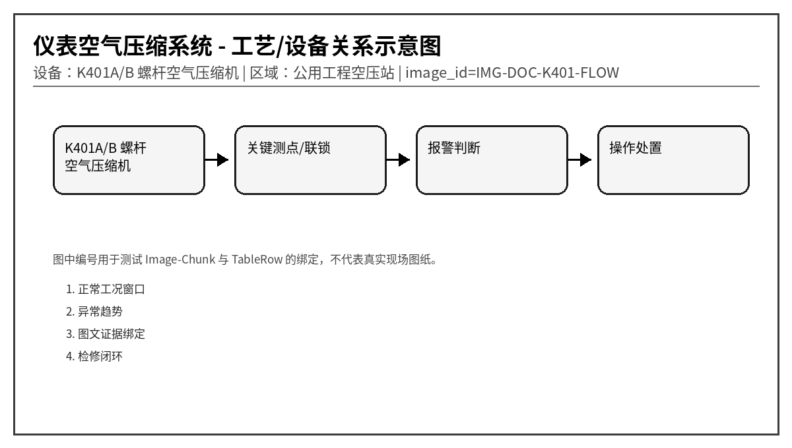
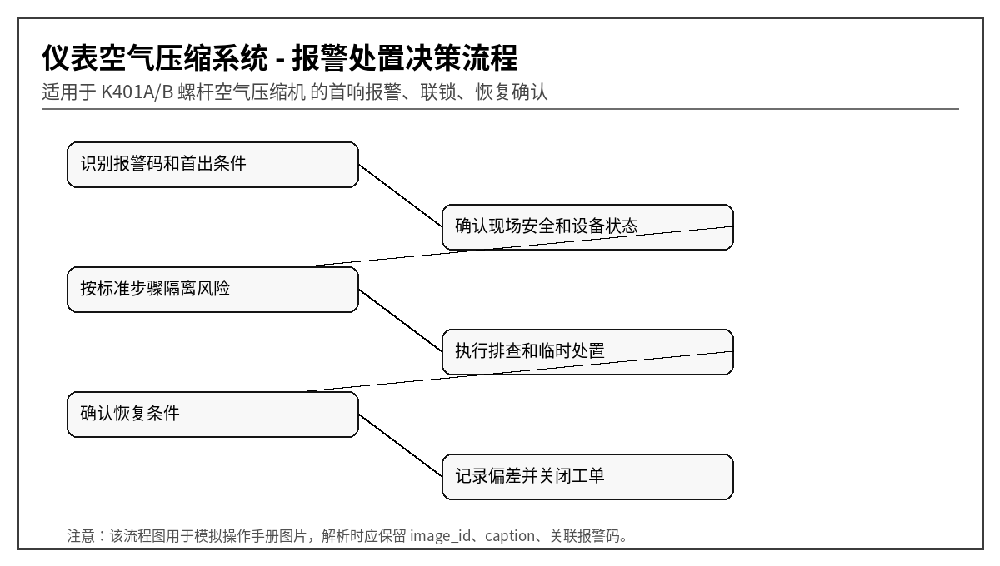

# K401 螺杆空气压缩机异常报警与操作维护手册
文档编号：DOC-K401  
版本：V1.0-模拟语料  
系统：仪表空气压缩系统  
设备：K401A/B 螺杆空气压缩机  
区域：公用工程空压站
> 说明：本文档为模拟语料，用于知识库 Agent、RAG、GraphRAG、表格解析、图片绑定和报警处置问答测试，不代表真实装置操作票。
## 1. 适用范围与系统边界
本文档描述 K401 螺杆空压机在加载、卸载、干燥、排凝和联锁保护过程中的异常处理。重点覆盖排气压力、排气温度、油分压差、进气过滤、露点、排凝和紧急停车。

## 2. 正常运行窗口
| 位号 | 参数 | 单位 | 正常范围 | 说明 |
|---|---|---|---|---|
| K401_DISP | 排气压力 | MPa | 0.62 ~ 0.78 | 低于 0.58 影响仪表气 |
| K401_OUTT | 排气温度 | ℃ | < 95 | 高高 110℃ 跳机 |
| K401_OILDP | 油分离器压差 | kPa | < 65 | 压差高说明油分堵塞 |
| K401_DEWP | 干燥机出口露点 | ℃ | < -20 | 露点高会导致阀岛积水 |
| K401_MCUR | 主电机电流 | A | < 额定 100% | 加载时短时升高正常 |

## 3. 报警总览表
| alarm_code | 报警名称 | 等级 | 触发位号 | 触发条件 | 关联图片ID |
|---|---|---|---|---|---|
| K401-A001 | 排气压力高 | 中 | K401_DISP | 连续 10 s > 0.82 MPa | IMG-DOC-K401-PRESS |
| K401-A002 | 排气温度高 | 高 | K401_OUTT | 连续 30 s > 100 ℃ | IMG-DOC-K401-TEMP |
| K401-A003 | 油分离器压差高 | 中 | K401_OILDP | 连续 5 min > 75 kPa | IMG-DOC-K401-OILDP |
| K401-A004 | 机体振动高 | 高 | K401_VIB | 连续 30 s > 6.0 mm/s | IMG-DOC-K401-VIB |
| K401-A005 | 进气过滤器压差高 | 低 | K401_AIRDP | 连续 10 min > 1.8 kPa | IMG-DOC-K401-FILTER |
| K401-A006 | 主电机过载 | 高 | K401_MCUR | 连续 15 s > 额定 115% | IMG-DOC-K401-MCUR |
| K401-A007 | 干燥机出口露点高 | 中 | K401_DEWP | 连续 15 min > -10 ℃ | IMG-DOC-K401-DEW |
| K401-A008 | 自动排凝故障 | 中 | K401_DRAIN | 排凝阀动作后液位仍高 | IMG-DOC-K401-DRAIN |
| K401-A009 | 紧急停车按钮动作 | 高高 | K401_ESTOP | 急停回路断开 | IMG-DOC-K401-ESTOP |
| K401-A010 | 加载/卸载切换失败 | 中 | K401_LOAD | 命令发出后 20 s 状态未变化 | IMG-DOC-K401-LOAD |

## 4. 逐项报警处置卡

### 4.1 K401-A001 排气压力高
- chunk_id：DOC-K401-CH-001
- row_id：DOC-K401-TALARM-R001
- 触发位号：K401_DISP
- 触发条件：连续 10 s > 0.82 MPa
- 严重等级：中
- 关联图片：IMG-DOC-K401-PRESS

**可能原因：**
1. 管网用气量突然降低
1. 卸载阀动作迟滞
1. 压力传感器零点漂移
1. 出口止回阀回座不良

**标准操作步骤：**
1. 检查加载/卸载状态是否正确
2. 确认下游储气罐压力和安全阀状态
3. 切换至手动卸载观察压力下降
4. 安排仪表校验压力变送器

**恢复条件：** 压力低于 0.76 MPa 后自动复位。

**GraphRAG 建议三元组：**
- (:Alarm {code:'K401-A001'})-[:BELONGS_TO]->(:Device {name:'K401A/B 螺杆空气压缩机'})
- (:Alarm {code:'K401-A001'})-[:HAS_ACTION]->(:Action {text:'检查加载/卸载状态是否正确'})
- (:TableRow {row_id:'DOC-K401-TALARM-R001'})-[:MENTIONS]->(:Alarm {code:'K401-A001'})
- (:TableRow {row_id:'DOC-K401-TALARM-R001'})-[:HAS_IMAGE]->(:Image {image_id:'IMG-DOC-K401-PRESS'})

### 4.2 K401-A002 排气温度高
- chunk_id：DOC-K401-CH-002
- row_id：DOC-K401-TALARM-R002
- 触发位号：K401_OUTT
- 触发条件：连续 30 s > 100 ℃
- 严重等级：高
- 关联图片：IMG-DOC-K401-TEMP

**可能原因：**
1. 冷却器结垢或风扇故障
1. 润滑油油位低
1. 环境温度过高且通风差
1. 温度探头贴合不良或老化

**标准操作步骤：**
1. 检查冷却风扇和冷却器进出口温差
2. 确认油位和油品颜色
3. 降低加载率并观察温度趋势
4. 超过 110℃ 立即停机保护

**恢复条件：** 排气温度 < 88℃ 且冷却系统正常。

**GraphRAG 建议三元组：**
- (:Alarm {code:'K401-A002'})-[:BELONGS_TO]->(:Device {name:'K401A/B 螺杆空气压缩机'})
- (:Alarm {code:'K401-A002'})-[:HAS_ACTION]->(:Action {text:'检查冷却风扇和冷却器进出口温差'})
- (:TableRow {row_id:'DOC-K401-TALARM-R002'})-[:MENTIONS]->(:Alarm {code:'K401-A002'})
- (:TableRow {row_id:'DOC-K401-TALARM-R002'})-[:HAS_IMAGE]->(:Image {image_id:'IMG-DOC-K401-TEMP'})

### 4.3 K401-A003 油分离器压差高
- chunk_id：DOC-K401-CH-003
- row_id：DOC-K401-TALARM-R003
- 触发位号：K401_OILDP
- 触发条件：连续 5 min > 75 kPa
- 严重等级：中
- 关联图片：IMG-DOC-K401-OILDP

**可能原因：**
1. 油分芯堵塞
1. 润滑油劣化形成胶质
1. 回油管堵塞
1. 压差取压口堵塞

**标准操作步骤：**
1. 记录压差趋势并降低负荷
2. 检查油分芯更换周期
3. 确认回油管温度和流通状态
4. 计划停机更换油分芯

**恢复条件：** 压差 < 55 kPa，且油耗恢复正常。

**GraphRAG 建议三元组：**
- (:Alarm {code:'K401-A003'})-[:BELONGS_TO]->(:Device {name:'K401A/B 螺杆空气压缩机'})
- (:Alarm {code:'K401-A003'})-[:HAS_ACTION]->(:Action {text:'记录压差趋势并降低负荷'})
- (:TableRow {row_id:'DOC-K401-TALARM-R003'})-[:MENTIONS]->(:Alarm {code:'K401-A003'})
- (:TableRow {row_id:'DOC-K401-TALARM-R003'})-[:HAS_IMAGE]->(:Image {image_id:'IMG-DOC-K401-OILDP'})

### 4.4 K401-A004 机体振动高
- chunk_id：DOC-K401-CH-004
- row_id：DOC-K401-TALARM-R004
- 触发位号：K401_VIB
- 触发条件：连续 30 s > 6.0 mm/s
- 严重等级：高
- 关联图片：IMG-DOC-K401-VIB

**可能原因：**
1. 主机轴承磨损
1. 联轴器弹性体损坏
1. 地脚螺栓松动
1. 油温高导致润滑不足

**标准操作步骤：**
1. 检查是否伴随排气温度高
2. 现场听诊确认异响位置
3. 采集频谱区分转频与轴承高频
4. 必要时停机切备用机

**恢复条件：** 振动 < 4.5 mm/s 且无异常声。

**GraphRAG 建议三元组：**
- (:Alarm {code:'K401-A004'})-[:BELONGS_TO]->(:Device {name:'K401A/B 螺杆空气压缩机'})
- (:Alarm {code:'K401-A004'})-[:HAS_ACTION]->(:Action {text:'检查是否伴随排气温度高'})
- (:TableRow {row_id:'DOC-K401-TALARM-R004'})-[:MENTIONS]->(:Alarm {code:'K401-A004'})
- (:TableRow {row_id:'DOC-K401-TALARM-R004'})-[:HAS_IMAGE]->(:Image {image_id:'IMG-DOC-K401-VIB'})

### 4.5 K401-A005 进气过滤器压差高
- chunk_id：DOC-K401-CH-005
- row_id：DOC-K401-TALARM-R005
- 触发位号：K401_AIRDP
- 触发条件：连续 10 min > 1.8 kPa
- 严重等级：低
- 关联图片：IMG-DOC-K401-FILTER

**可能原因：**
1. 滤芯积尘严重
1. 进气口附近有施工扬尘
1. 压差管积水
1. 滤芯安装方向错误

**标准操作步骤：**
1. 检查进气滤芯污染程度
2. 临时降低加载率避免负压过大
3. 吹扫压差管并核对读数
4. 更换滤芯后记录压差基线

**恢复条件：** 压差 < 1.0 kPa。

**GraphRAG 建议三元组：**
- (:Alarm {code:'K401-A005'})-[:BELONGS_TO]->(:Device {name:'K401A/B 螺杆空气压缩机'})
- (:Alarm {code:'K401-A005'})-[:HAS_ACTION]->(:Action {text:'检查进气滤芯污染程度'})
- (:TableRow {row_id:'DOC-K401-TALARM-R005'})-[:MENTIONS]->(:Alarm {code:'K401-A005'})
- (:TableRow {row_id:'DOC-K401-TALARM-R005'})-[:HAS_IMAGE]->(:Image {image_id:'IMG-DOC-K401-FILTER'})

### 4.6 K401-A006 主电机过载
- chunk_id：DOC-K401-CH-006
- row_id：DOC-K401-TALARM-R006
- 触发位号：K401_MCUR
- 触发条件：连续 15 s > 额定 115%
- 严重等级：高
- 关联图片：IMG-DOC-K401-MCUR

**可能原因：**
1. 排气压力偏高导致负荷过大
1. 电源电压偏低
1. 轴承或主机摩擦阻力增大
1. 电机保护参数设置不匹配

**标准操作步骤：**
1. 核对管网压力和加载阀状态
2. 检查三相电压平衡度
3. 短时卸载验证电流是否下降
4. 保护跳闸后禁止连续强启

**恢复条件：** 电流回到额定 95% 以下并确认无机械卡涩。

**GraphRAG 建议三元组：**
- (:Alarm {code:'K401-A006'})-[:BELONGS_TO]->(:Device {name:'K401A/B 螺杆空气压缩机'})
- (:Alarm {code:'K401-A006'})-[:HAS_ACTION]->(:Action {text:'核对管网压力和加载阀状态'})
- (:TableRow {row_id:'DOC-K401-TALARM-R006'})-[:MENTIONS]->(:Alarm {code:'K401-A006'})
- (:TableRow {row_id:'DOC-K401-TALARM-R006'})-[:HAS_IMAGE]->(:Image {image_id:'IMG-DOC-K401-MCUR'})

### 4.7 K401-A007 干燥机出口露点高
- chunk_id：DOC-K401-CH-007
- row_id：DOC-K401-TALARM-R007
- 触发位号：K401_DEWP
- 触发条件：连续 15 min > -10 ℃
- 严重等级：中
- 关联图片：IMG-DOC-K401-DEW

**可能原因：**
1. 再生气量不足
1. 吸附塔切换阀泄漏
1. 前置排水不充分导致液态水进入
1. 露点仪探头污染

**标准操作步骤：**
1. 检查干燥机运行周期和切塔动作
2. 确认前后置过滤器排水正常
3. 临时旁通前不得直接供关键仪表
4. 校验露点仪并清洁探头

**恢复条件：** 露点 < -20℃ 且稳定 30 min。

**GraphRAG 建议三元组：**
- (:Alarm {code:'K401-A007'})-[:BELONGS_TO]->(:Device {name:'K401A/B 螺杆空气压缩机'})
- (:Alarm {code:'K401-A007'})-[:HAS_ACTION]->(:Action {text:'检查干燥机运行周期和切塔动作'})
- (:TableRow {row_id:'DOC-K401-TALARM-R007'})-[:MENTIONS]->(:Alarm {code:'K401-A007'})
- (:TableRow {row_id:'DOC-K401-TALARM-R007'})-[:HAS_IMAGE]->(:Image {image_id:'IMG-DOC-K401-DEW'})

### 4.8 K401-A008 自动排凝故障
- chunk_id：DOC-K401-CH-008
- row_id：DOC-K401-TALARM-R008
- 触发位号：K401_DRAIN
- 触发条件：排凝阀动作后液位仍高
- 严重等级：中
- 关联图片：IMG-DOC-K401-DRAIN

**可能原因：**
1. 电子排水阀堵塞
1. 排水管冻结或背压高
1. 液位开关粘连
1. 过滤器含水量异常增大

**标准操作步骤：**
1. 手动排凝并观察排水量
2. 拆检排水阀滤网
3. 检查排水管伴热和背压
4. 排凝恢复前加强巡检频次

**恢复条件：** 排凝阀动作后液位下降至正常。

**GraphRAG 建议三元组：**
- (:Alarm {code:'K401-A008'})-[:BELONGS_TO]->(:Device {name:'K401A/B 螺杆空气压缩机'})
- (:Alarm {code:'K401-A008'})-[:HAS_ACTION]->(:Action {text:'手动排凝并观察排水量'})
- (:TableRow {row_id:'DOC-K401-TALARM-R008'})-[:MENTIONS]->(:Alarm {code:'K401-A008'})
- (:TableRow {row_id:'DOC-K401-TALARM-R008'})-[:HAS_IMAGE]->(:Image {image_id:'IMG-DOC-K401-DRAIN'})

### 4.9 K401-A009 紧急停车按钮动作
- chunk_id：DOC-K401-CH-009
- row_id：DOC-K401-TALARM-R009
- 触发位号：K401_ESTOP
- 触发条件：急停回路断开
- 严重等级：高高
- 关联图片：IMG-DOC-K401-ESTOP

**可能原因：**
1. 现场急停按钮被按下
1. 急停线路断线
1. 安全继电器故障
1. 检修隔离未解除

**标准操作步骤：**
1. 确认人员安全和现场原因
2. 禁止远程复位代替现场确认
3. 复位急停并检查安全继电器状态
4. 记录急停原因和恢复人

**恢复条件：** 现场确认安全，急停复位，安全回路闭合。

**GraphRAG 建议三元组：**
- (:Alarm {code:'K401-A009'})-[:BELONGS_TO]->(:Device {name:'K401A/B 螺杆空气压缩机'})
- (:Alarm {code:'K401-A009'})-[:HAS_ACTION]->(:Action {text:'确认人员安全和现场原因'})
- (:TableRow {row_id:'DOC-K401-TALARM-R009'})-[:MENTIONS]->(:Alarm {code:'K401-A009'})
- (:TableRow {row_id:'DOC-K401-TALARM-R009'})-[:HAS_IMAGE]->(:Image {image_id:'IMG-DOC-K401-ESTOP'})

### 4.10 K401-A010 加载/卸载切换失败
- chunk_id：DOC-K401-CH-010
- row_id：DOC-K401-TALARM-R010
- 触发位号：K401_LOAD
- 触发条件：命令发出后 20 s 状态未变化
- 严重等级：中
- 关联图片：IMG-DOC-K401-LOAD

**可能原因：**
1. 加载电磁阀失电或卡涩
1. 卸载阀气源不足
1. 控制器输出故障
1. 状态反馈开关失准

**标准操作步骤：**
1. 检查电磁阀线圈和气源压力
2. 手动动作加载阀确认机械灵活性
3. 核对 PLC 输出和反馈点
4. 必要时切备用机供气

**恢复条件：** 加载/卸载动作试验连续 3 次正常。

**GraphRAG 建议三元组：**
- (:Alarm {code:'K401-A010'})-[:BELONGS_TO]->(:Device {name:'K401A/B 螺杆空气压缩机'})
- (:Alarm {code:'K401-A010'})-[:HAS_ACTION]->(:Action {text:'检查电磁阀线圈和气源压力'})
- (:TableRow {row_id:'DOC-K401-TALARM-R010'})-[:MENTIONS]->(:Alarm {code:'K401-A010'})
- (:TableRow {row_id:'DOC-K401-TALARM-R010'})-[:HAS_IMAGE]->(:Image {image_id:'IMG-DOC-K401-LOAD'})

## 5. 易混淆报警与反例
- 同样是“压力高”，若伴随电流高，优先考虑负荷/阀位；若就地表正常而 DCS 偏高，优先考虑仪表导压或传感器。
- 同样是“振动高”，若吸入口压力低或流量波动，优先考虑汽蚀；若 1X 转频主导，优先考虑不平衡；若高频包络谱特征明显，优先考虑轴承故障。
- 对于高高联锁报警，回答中必须体现“先确认安全，再恢复生产”，不能只给重启步骤。

## 6. 班组交接记录模板
| 时间 | 报警码 | 首出/伴随报警 | 已执行操作 | 当前状态 | 交接人 |
|---|---|---|---|---|---|
| 2026-05-28 09:10 | 示例 | 示例 | 示例 | 示例 | 示例 |
