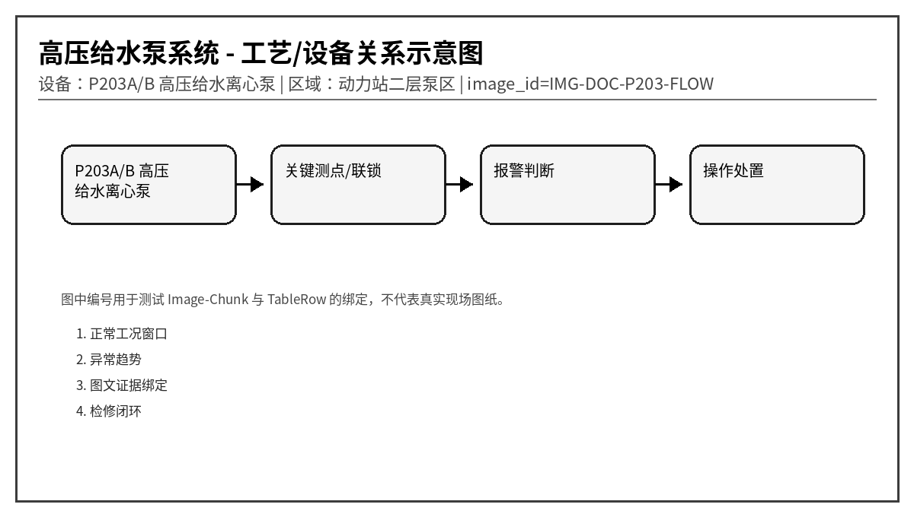
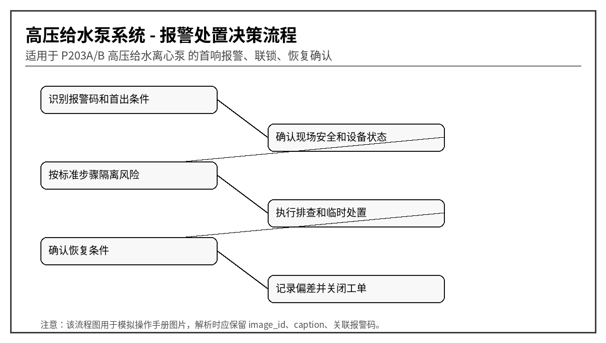

# P203A/B 高压给水离心泵异常报警与操作手册
文档编号：DOC-P203  
版本：V1.0-模拟语料  
系统：高压给水泵系统  
设备：P203A/B 高压给水离心泵  
区域：动力站二层泵区
> 说明：本文档为模拟语料，用于知识库 Agent、RAG、GraphRAG、表格解析、图片绑定和报警处置问答测试，不代表真实装置操作票。
## 1. 适用范围与系统边界
本文档用于描述高压给水离心泵 P203A/B 在启动、运行、切换和停车过程中的典型异常、报警含义、排查路径和标准处置。重点覆盖吸入口压力、出口压力、振动、轴承温度、机械密封、润滑油和备用泵联锁。

## 2. 正常运行窗口
| 位号 | 参数 | 单位 | 正常范围 | 说明 |
|---|---|---|---|---|
| P203A_RUN | 运行状态 | 0/1 | 1 表示运行 | 用于判断主备泵切换 |
| P203_SUCP | 吸入口压力 | MPa | 0.18 ~ 0.45 | 低于下限易汽蚀 |
| P203_DISP | 出口压力 | MPa | 1.20 ~ 1.75 | 高于上限需检查下游阀门 |
| P203_VIB | 泵体振动速度 | mm/s | < 4.5 | 持续升高优先检查轴承和汽蚀 |
| P203_BT_DE | 驱动端轴承温度 | ℃ | < 75 | 高高报警 90℃ |
| P203_SEAL_FL | 机械密封冲洗流量 | L/min | 3.0 ~ 8.0 | 低流量可能导致密封面干磨 |

## 3. 报警总览表
| alarm_code | 报警名称 | 等级 | 触发位号 | 触发条件 | 关联图片ID |
|---|---|---|---|---|---|
| P203-A001 | 吸入口压力低 | 高 | P203_SUCP | 连续 10 s < 0.16 MPa | IMG-DOC-P203-SUCP |
| P203-A002 | 出口压力高 | 高 | P203_DISP | 连续 8 s > 1.85 MPa | IMG-DOC-P203-DISP |
| P203-A003 | 驱动端轴承温度高 | 中 | P203_BT_DE | 连续 60 s > 80 ℃ | IMG-DOC-P203-BEARING |
| P203-A004 | 泵体振动高 | 高 | P203_VIB | RMS 连续 30 s > 5.5 mm/s | IMG-DOC-P203-VIB |
| P203-A005 | 机械密封冲洗流量低 | 高 | P203_SEAL_FL | 连续 15 s < 2.5 L/min | IMG-DOC-P203-SEAL |
| P203-A006 | 电机电流高 | 中 | P203_MCUR | 连续 20 s > 额定电流 110% | IMG-DOC-P203-MCUR |
| P203-A007 | 疑似汽蚀 | 高 | P203_CAV | 吸压低且振动高频成分上升 | IMG-DOC-P203-CAV |
| P203-A008 | 润滑油压力低 | 高高 | P203_LOP | 连续 5 s < 0.08 MPa | IMG-DOC-P203-LOP |
| P203-A009 | 联轴器防护罩打开 | 低 | P203_GUARD | 防护罩限位开关断开 | IMG-DOC-P203-GUARD |
| P203-A010 | 备用泵自启动失败 | 高 | P203_STBY_FAIL | 主泵跳停后备用泵 15 s 内未反馈运行 | IMG-DOC-P203-STBY |

## 4. 逐项报警处置卡

### 4.1 P203-A001 吸入口压力低
- chunk_id：DOC-P203-CH-001
- row_id：DOC-P203-TALARM-R001
- 触发位号：P203_SUCP
- 触发条件：连续 10 s < 0.16 MPa
- 严重等级：高
- 关联图片：IMG-DOC-P203-SUCP

**可能原因：**
1. 上游罐液位低或入口阀未全开
1. 吸入过滤器堵塞导致压降增大
1. 泵入口管线存在气袋或排气不充分
1. 流量突增导致吸入侧压力瞬间下降

**标准操作步骤：**
1. 立即确认上游液位和入口阀开度
2. 检查吸入过滤器差压，必要时切换备用过滤器
3. 打开泵体排气点进行短时排气
4. 若振动同步升高，降低负荷并准备切备用泵

**恢复条件：** 吸入口压力稳定 > 0.22 MPa 且无汽蚀噪声 3 min。

**GraphRAG 建议三元组：**
- (:Alarm {code:'P203-A001'})-[:BELONGS_TO]->(:Device {name:'P203A/B 高压给水离心泵'})
- (:Alarm {code:'P203-A001'})-[:HAS_ACTION]->(:Action {text:'立即确认上游液位和入口阀开度'})
- (:TableRow {row_id:'DOC-P203-TALARM-R001'})-[:MENTIONS]->(:Alarm {code:'P203-A001'})
- (:TableRow {row_id:'DOC-P203-TALARM-R001'})-[:HAS_IMAGE]->(:Image {image_id:'IMG-DOC-P203-SUCP'})

### 4.2 P203-A002 出口压力高
- chunk_id：DOC-P203-CH-002
- row_id：DOC-P203-TALARM-R002
- 触发位号：P203_DISP
- 触发条件：连续 8 s > 1.85 MPa
- 严重等级：高
- 关联图片：IMG-DOC-P203-DISP

**可能原因：**
1. 下游调节阀或截止阀误关
1. 出口止回阀卡滞造成压力波动
1. 工艺侧需求降低但泵仍高频运行
1. 压力变送器导压管堵塞造成假高值

**标准操作步骤：**
1. 核对出口阀、旁路阀和下游调节阀状态
2. 逐步降低变频器频率，禁止骤停造成水锤
3. 比对就地压力表和 DCS 压力值
4. 确认误报警后填写仪表检查单

**恢复条件：** 出口压力回落到 1.65 MPa 以下并保持稳定。

**GraphRAG 建议三元组：**
- (:Alarm {code:'P203-A002'})-[:BELONGS_TO]->(:Device {name:'P203A/B 高压给水离心泵'})
- (:Alarm {code:'P203-A002'})-[:HAS_ACTION]->(:Action {text:'核对出口阀、旁路阀和下游调节阀状态'})
- (:TableRow {row_id:'DOC-P203-TALARM-R002'})-[:MENTIONS]->(:Alarm {code:'P203-A002'})
- (:TableRow {row_id:'DOC-P203-TALARM-R002'})-[:HAS_IMAGE]->(:Image {image_id:'IMG-DOC-P203-DISP'})

### 4.3 P203-A003 驱动端轴承温度高
- chunk_id：DOC-P203-CH-003
- row_id：DOC-P203-TALARM-R003
- 触发位号：P203_BT_DE
- 触发条件：连续 60 s > 80 ℃
- 严重等级：中
- 关联图片：IMG-DOC-P203-BEARING

**可能原因：**
1. 润滑脂过少或过量导致发热
1. 轴承游隙异常或滚道损伤
1. 联轴器对中不良引入附加载荷
1. 环境温度高且通风不良

**标准操作步骤：**
1. 检查轴承箱外表温度与红外测温结果
2. 查看近 8 小时温度趋势是否阶跃上升
3. 降低泵负荷并安排现场听诊
4. 若温度超过 90℃或伴随异响，立即切换备用泵

**恢复条件：** 轴承温度 < 72℃ 且趋势不再上升。

**GraphRAG 建议三元组：**
- (:Alarm {code:'P203-A003'})-[:BELONGS_TO]->(:Device {name:'P203A/B 高压给水离心泵'})
- (:Alarm {code:'P203-A003'})-[:HAS_ACTION]->(:Action {text:'检查轴承箱外表温度与红外测温结果'})
- (:TableRow {row_id:'DOC-P203-TALARM-R003'})-[:MENTIONS]->(:Alarm {code:'P203-A003'})
- (:TableRow {row_id:'DOC-P203-TALARM-R003'})-[:HAS_IMAGE]->(:Image {image_id:'IMG-DOC-P203-BEARING'})

### 4.4 P203-A004 泵体振动高
- chunk_id：DOC-P203-CH-004
- row_id：DOC-P203-TALARM-R004
- 触发位号：P203_VIB
- 触发条件：RMS 连续 30 s > 5.5 mm/s
- 严重等级：高
- 关联图片：IMG-DOC-P203-VIB

**可能原因：**
1. 吸入压力低引起汽蚀
1. 叶轮积垢或局部损坏导致不平衡
1. 地脚螺栓松动或基础刚度下降
1. 联轴器不对中或轴承缺陷

**标准操作步骤：**
1. 先排除 P203-A001 是否同时存在
2. 检查泵体、轴承箱和管线是否异常振动
3. 采集频谱，区分 1X 不平衡与高频汽蚀
4. 超过 7.1 mm/s 时切备用泵并申请检修

**恢复条件：** 振动 RMS < 4.0 mm/s 且频谱无新增异常峰。

**GraphRAG 建议三元组：**
- (:Alarm {code:'P203-A004'})-[:BELONGS_TO]->(:Device {name:'P203A/B 高压给水离心泵'})
- (:Alarm {code:'P203-A004'})-[:HAS_ACTION]->(:Action {text:'先排除 P203-A001 是否同时存在'})
- (:TableRow {row_id:'DOC-P203-TALARM-R004'})-[:MENTIONS]->(:Alarm {code:'P203-A004'})
- (:TableRow {row_id:'DOC-P203-TALARM-R004'})-[:HAS_IMAGE]->(:Image {image_id:'IMG-DOC-P203-VIB'})

### 4.5 P203-A005 机械密封冲洗流量低
- chunk_id：DOC-P203-CH-005
- row_id：DOC-P203-TALARM-R005
- 触发位号：P203_SEAL_FL
- 触发条件：连续 15 s < 2.5 L/min
- 严重等级：高
- 关联图片：IMG-DOC-P203-SEAL

**可能原因：**
1. 冲洗管路节流孔堵塞
1. 密封冲洗阀误关或开度不足
1. 冲洗液过滤器堵塞
1. 流量计脏污或卡涩

**标准操作步骤：**
1. 核对冲洗阀开度和流量计指示
2. 打开备用冲洗支路进行比对
3. 检查密封腔温度和泄漏量
4. 禁止长时间带低冲洗运行，必要时停泵保护密封

**恢复条件：** 冲洗流量 > 3.5 L/min 且密封腔温度正常。

**GraphRAG 建议三元组：**
- (:Alarm {code:'P203-A005'})-[:BELONGS_TO]->(:Device {name:'P203A/B 高压给水离心泵'})
- (:Alarm {code:'P203-A005'})-[:HAS_ACTION]->(:Action {text:'核对冲洗阀开度和流量计指示'})
- (:TableRow {row_id:'DOC-P203-TALARM-R005'})-[:MENTIONS]->(:Alarm {code:'P203-A005'})
- (:TableRow {row_id:'DOC-P203-TALARM-R005'})-[:HAS_IMAGE]->(:Image {image_id:'IMG-DOC-P203-SEAL'})

### 4.6 P203-A006 电机电流高
- chunk_id：DOC-P203-CH-006
- row_id：DOC-P203-TALARM-R006
- 触发位号：P203_MCUR
- 触发条件：连续 20 s > 额定电流 110%
- 严重等级：中
- 关联图片：IMG-DOC-P203-MCUR

**可能原因：**
1. 出口压力高导致轴功率增加
1. 泵内有异物或转子摩擦
1. 电机绕组温度升高导致负载能力下降
1. 电流互感器量程配置错误

**标准操作步骤：**
1. 确认出口压力和流量是否超出工况点
2. 检查是否有异常摩擦声
3. 必要时降低频率至安全负荷
4. 仪表可疑时比对 MCC 柜电流表

**恢复条件：** 电流 < 额定电流 95% 并稳定 5 min。

**GraphRAG 建议三元组：**
- (:Alarm {code:'P203-A006'})-[:BELONGS_TO]->(:Device {name:'P203A/B 高压给水离心泵'})
- (:Alarm {code:'P203-A006'})-[:HAS_ACTION]->(:Action {text:'确认出口压力和流量是否超出工况点'})
- (:TableRow {row_id:'DOC-P203-TALARM-R006'})-[:MENTIONS]->(:Alarm {code:'P203-A006'})
- (:TableRow {row_id:'DOC-P203-TALARM-R006'})-[:HAS_IMAGE]->(:Image {image_id:'IMG-DOC-P203-MCUR'})

### 4.7 P203-A007 疑似汽蚀
- chunk_id：DOC-P203-CH-007
- row_id：DOC-P203-TALARM-R007
- 触发位号：P203_CAV
- 触发条件：吸压低且振动高频成分上升
- 严重等级：高
- 关联图片：IMG-DOC-P203-CAV

**可能原因：**
1. 入口液位不足
1. 入口管线局部堵塞
1. 介质温度过高接近饱和
1. 泵运行点偏离设计区间

**标准操作步骤：**
1. 降低泵流量或频率
2. 提高入口液位或打开补液阀
3. 确认入口过滤器差压
4. 若噪声呈砂石声，应尽快切泵

**恢复条件：** 吸入口压力恢复且汽蚀噪声明显消失。

**GraphRAG 建议三元组：**
- (:Alarm {code:'P203-A007'})-[:BELONGS_TO]->(:Device {name:'P203A/B 高压给水离心泵'})
- (:Alarm {code:'P203-A007'})-[:HAS_ACTION]->(:Action {text:'降低泵流量或频率'})
- (:TableRow {row_id:'DOC-P203-TALARM-R007'})-[:MENTIONS]->(:Alarm {code:'P203-A007'})
- (:TableRow {row_id:'DOC-P203-TALARM-R007'})-[:HAS_IMAGE]->(:Image {image_id:'IMG-DOC-P203-CAV'})

### 4.8 P203-A008 润滑油压力低
- chunk_id：DOC-P203-CH-008
- row_id：DOC-P203-TALARM-R008
- 触发位号：P203_LOP
- 触发条件：连续 5 s < 0.08 MPa
- 严重等级：高高
- 关联图片：IMG-DOC-P203-LOP

**可能原因：**
1. 润滑油泵故障
1. 油位低或油路泄漏
1. 油过滤器堵塞
1. 压力开关接线松动

**标准操作步骤：**
1. 立即检查油位和油压表
2. 启动备用油泵或切换备用泵
3. 禁止在油压低状态下继续运行
4. 通知维修检查油过滤器和油路

**恢复条件：** 油压 > 0.12 MPa 且轴承温度无继续上升。

**GraphRAG 建议三元组：**
- (:Alarm {code:'P203-A008'})-[:BELONGS_TO]->(:Device {name:'P203A/B 高压给水离心泵'})
- (:Alarm {code:'P203-A008'})-[:HAS_ACTION]->(:Action {text:'立即检查油位和油压表'})
- (:TableRow {row_id:'DOC-P203-TALARM-R008'})-[:MENTIONS]->(:Alarm {code:'P203-A008'})
- (:TableRow {row_id:'DOC-P203-TALARM-R008'})-[:HAS_IMAGE]->(:Image {image_id:'IMG-DOC-P203-LOP'})

### 4.9 P203-A009 联轴器防护罩打开
- chunk_id：DOC-P203-CH-009
- row_id：DOC-P203-TALARM-R009
- 触发位号：P203_GUARD
- 触发条件：防护罩限位开关断开
- 严重等级：低
- 关联图片：IMG-DOC-P203-GUARD

**可能原因：**
1. 检修后防护罩未复位
1. 限位开关松动
1. 线缆接头进水
1. 误碰防护罩导致瞬时报警

**标准操作步骤：**
1. 禁止靠近旋转部件
2. 现场确认防护罩安装状态
3. 复位限位开关并检查紧固
4. 检修票关闭前不得强制屏蔽

**恢复条件：** 防护罩复位且安全员确认。

**GraphRAG 建议三元组：**
- (:Alarm {code:'P203-A009'})-[:BELONGS_TO]->(:Device {name:'P203A/B 高压给水离心泵'})
- (:Alarm {code:'P203-A009'})-[:HAS_ACTION]->(:Action {text:'禁止靠近旋转部件'})
- (:TableRow {row_id:'DOC-P203-TALARM-R009'})-[:MENTIONS]->(:Alarm {code:'P203-A009'})
- (:TableRow {row_id:'DOC-P203-TALARM-R009'})-[:HAS_IMAGE]->(:Image {image_id:'IMG-DOC-P203-GUARD'})

### 4.10 P203-A010 备用泵自启动失败
- chunk_id：DOC-P203-CH-010
- row_id：DOC-P203-TALARM-R010
- 触发位号：P203_STBY_FAIL
- 触发条件：主泵跳停后备用泵 15 s 内未反馈运行
- 严重等级：高
- 关联图片：IMG-DOC-P203-STBY

**可能原因：**
1. 备用泵就地/远程开关不在远程
1. 备用泵电气故障或 MCC 未合闸
1. 出口阀联锁未满足
1. DCS 启动命令未下发或反馈丢失

**标准操作步骤：**
1. 立即人工确认备用泵状态
2. 检查 MCC、远程模式和联锁条件
3. 必要时按现场规程手动启动备用泵
4. 记录自启动失败前后的事件顺序

**恢复条件：** 备用泵远程启动试验成功。

**GraphRAG 建议三元组：**
- (:Alarm {code:'P203-A010'})-[:BELONGS_TO]->(:Device {name:'P203A/B 高压给水离心泵'})
- (:Alarm {code:'P203-A010'})-[:HAS_ACTION]->(:Action {text:'立即人工确认备用泵状态'})
- (:TableRow {row_id:'DOC-P203-TALARM-R010'})-[:MENTIONS]->(:Alarm {code:'P203-A010'})
- (:TableRow {row_id:'DOC-P203-TALARM-R010'})-[:HAS_IMAGE]->(:Image {image_id:'IMG-DOC-P203-STBY'})

## 5. 易混淆报警与反例
- 同样是“压力高”，若伴随电流高，优先考虑负荷/阀位；若就地表正常而 DCS 偏高，优先考虑仪表导压或传感器。
- 同样是“振动高”，若吸入口压力低或流量波动，优先考虑汽蚀；若 1X 转频主导，优先考虑不平衡；若高频包络谱特征明显，优先考虑轴承故障。
- 对于高高联锁报警，回答中必须体现“先确认安全，再恢复生产”，不能只给重启步骤。

## 6. 班组交接记录模板
| 时间 | 报警码 | 首出/伴随报警 | 已执行操作 | 当前状态 | 交接人 |
|---|---|---|---|---|---|
| 2026-05-28 09:10 | 示例 | 示例 | 示例 | 示例 | 示例 |
