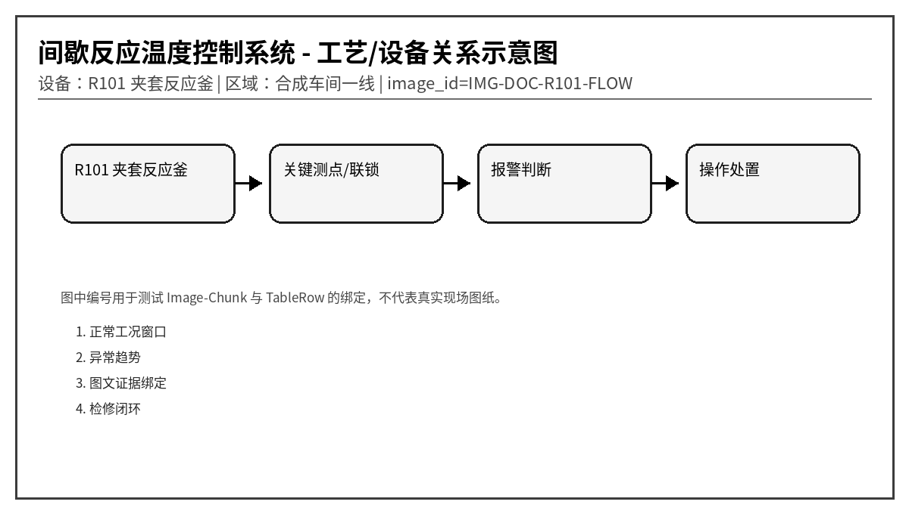
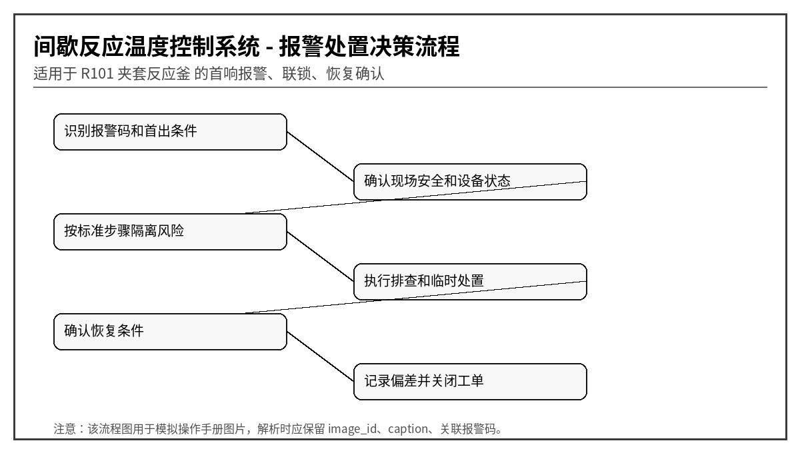

# R101 反应釜温控与联锁异常操作指导书
文档编号：DOC-R101  
版本：V1.0-模拟语料  
系统：间歇反应温度控制系统  
设备：R101 夹套反应釜  
区域：合成车间一线
> 说明：本文档为模拟语料，用于知识库 Agent、RAG、GraphRAG、表格解析、图片绑定和报警处置问答测试，不代表真实装置操作票。
## 1. 适用范围与系统边界
本文档覆盖 R101 反应釜在升温、恒温、投料、放热反应、冷却和保压阶段的异常处理，重点强调温度偏差、放热速率、搅拌、冷却水、蒸汽阀、氮封压力和批次保持。

## 2. 正常运行窗口
| 位号 | 参数 | 单位 | 正常范围 | 说明 |
|---|---|---|---|---|
| R101_T | 釜内温度 | ℃ | 按配方阶段 25 ~ 135 | 超过配方上限触发联锁 |
| R101_JT | 夹套温度 | ℃ | 釜温 ± 15 | 夹套过热可能导致局部过冲 |
| R101_AGI | 搅拌状态 | 0/1 | 反应阶段必须为 1 | 搅拌停止需暂停投料 |
| R101_CWF | 冷却水流量 | m3/h | > 18 | 低流量影响放热控制 |
| R101_N2P | 氮封压力 | kPa | 3 ~ 8 | 低压可能吸入空气 |

## 3. 报警总览表
| alarm_code | 报警名称 | 等级 | 触发位号 | 触发条件 | 关联图片ID |
|---|---|---|---|---|---|
| R101-A001 | 夹套温度高 | 高 | R101_JT | 夹套温度 > 150℃ 持续 20 s | IMG-DOC-R101-JACKET |
| R101-A002 | 釜温偏差大 | 中 | R101_TDEV | |釜温-设定值| > 8℃ 持续 2 min | IMG-DOC-R101-TDEV |
| R101-A003 | 搅拌器跳停 | 高高 | R101_AGI | 运行命令存在但反馈为 0 超过 5 s | IMG-DOC-R101-AGI |
| R101-A004 | 冷却水流量低 | 高 | R101_CWF | 冷却水流量 < 15 m3/h 持续 30 s | IMG-DOC-R101-CWF |
| R101-A005 | 蒸汽阀疑似卡滞 | 高 | R101_STV | 阀门命令变化后反馈偏差 > 15% 持续 30 s | IMG-DOC-R101-STV |
| R101-A006 | 釜温传感器漂移 | 中 | R101_T | 双支温度差 > 4℃ 持续 5 min | IMG-DOC-R101-SENSOR |
| R101-A007 | 放热速率高 | 高高 | R101_DTD | dT/dt > 1.5℃/min 持续 2 min | IMG-DOC-R101-EXO |
| R101-A008 | 投料联锁动作 | 高 | R101_FEED_ILK | 任一投料前置条件不满足 | IMG-DOC-R101-FEED |
| R101-A009 | 氮封压力低 | 中 | R101_N2P | 氮封压力 < 2 kPa 持续 60 s | IMG-DOC-R101-N2 |
| R101-A010 | 批次保持要求 | 中 | R101_HOLD | 异常条件触发后进入 HOLD | IMG-DOC-R101-HOLD |

## 4. 逐项报警处置卡

### 4.1 R101-A001 夹套温度高
- chunk_id：DOC-R101-CH-001
- row_id：DOC-R101-TALARM-R001
- 触发位号：R101_JT
- 触发条件：夹套温度 > 150℃ 持续 20 s
- 严重等级：高
- 关联图片：IMG-DOC-R101-JACKET

**可能原因：**
1. 蒸汽调节阀泄漏或卡开
1. 温控 PID 输出过大
1. 夹套温度传感器偏高
1. 阶段切换后蒸汽未及时关闭

**标准操作步骤：**
1. 立即关闭蒸汽切断阀并确认反馈
2. 打开冷却水小流量旁路降低夹套温度
3. 检查 PID 手/自动状态和输出限幅
4. 记录阶段号和投料状态

**恢复条件：** 夹套温度 < 120℃ 且蒸汽阀关闭反馈正常。

**GraphRAG 建议三元组：**
- (:Alarm {code:'R101-A001'})-[:BELONGS_TO]->(:Device {name:'R101 夹套反应釜'})
- (:Alarm {code:'R101-A001'})-[:HAS_ACTION]->(:Action {text:'立即关闭蒸汽切断阀并确认反馈'})
- (:TableRow {row_id:'DOC-R101-TALARM-R001'})-[:MENTIONS]->(:Alarm {code:'R101-A001'})
- (:TableRow {row_id:'DOC-R101-TALARM-R001'})-[:HAS_IMAGE]->(:Image {image_id:'IMG-DOC-R101-JACKET'})

### 4.2 R101-A002 釜温偏差大
- chunk_id：DOC-R101-CH-002
- row_id：DOC-R101-TALARM-R002
- 触发位号：R101_TDEV
- 触发条件：|釜温-设定值| > 8℃ 持续 2 min
- 严重等级：中
- 关联图片：IMG-DOC-R101-TDEV

**可能原因：**
1. PID 参数不适合当前批次
1. 冷却水或蒸汽能力不足
1. 投料温度偏离配方
1. 温度探头插入深度异常

**标准操作步骤：**
1. 确认当前配方阶段和设定值
2. 检查加热/冷却执行器开度
3. 暂停非关键投料并观察趋势
4. 必要时切换为手动限幅控制

**恢复条件：** 偏差 < 3℃ 且趋势收敛。

**GraphRAG 建议三元组：**
- (:Alarm {code:'R101-A002'})-[:BELONGS_TO]->(:Device {name:'R101 夹套反应釜'})
- (:Alarm {code:'R101-A002'})-[:HAS_ACTION]->(:Action {text:'确认当前配方阶段和设定值'})
- (:TableRow {row_id:'DOC-R101-TALARM-R002'})-[:MENTIONS]->(:Alarm {code:'R101-A002'})
- (:TableRow {row_id:'DOC-R101-TALARM-R002'})-[:HAS_IMAGE]->(:Image {image_id:'IMG-DOC-R101-TDEV'})

### 4.3 R101-A003 搅拌器跳停
- chunk_id：DOC-R101-CH-003
- row_id：DOC-R101-TALARM-R003
- 触发位号：R101_AGI
- 触发条件：运行命令存在但反馈为 0 超过 5 s
- 严重等级：高高
- 关联图片：IMG-DOC-R101-AGI

**可能原因：**
1. 变频器故障
1. 机械密封抱死或搅拌轴卡涩
1. 电机过载保护动作
1. 检修联锁未解除

**标准操作步骤：**
1. 立即停止投料并进入批次保持
2. 确认釜内温升速率是否异常
3. 通知现场检查变频器故障码
4. 若反应放热，启动紧急冷却并准备泄压预案

**恢复条件：** 搅拌恢复并低速试运行无异常电流。

**GraphRAG 建议三元组：**
- (:Alarm {code:'R101-A003'})-[:BELONGS_TO]->(:Device {name:'R101 夹套反应釜'})
- (:Alarm {code:'R101-A003'})-[:HAS_ACTION]->(:Action {text:'立即停止投料并进入批次保持'})
- (:TableRow {row_id:'DOC-R101-TALARM-R003'})-[:MENTIONS]->(:Alarm {code:'R101-A003'})
- (:TableRow {row_id:'DOC-R101-TALARM-R003'})-[:HAS_IMAGE]->(:Image {image_id:'IMG-DOC-R101-AGI'})

### 4.4 R101-A004 冷却水流量低
- chunk_id：DOC-R101-CH-004
- row_id：DOC-R101-TALARM-R004
- 触发位号：R101_CWF
- 触发条件：冷却水流量 < 15 m3/h 持续 30 s
- 严重等级：高
- 关联图片：IMG-DOC-R101-CWF

**可能原因：**
1. 冷却水泵出口压力低
1. 夹套入口阀未打开
1. 过滤器堵塞
1. 流量计气泡或信号故障

**标准操作步骤：**
1. 检查冷却水总管压力和阀位
2. 打开备用冷却水支路
3. 暂停升温和放热投料
4. 与公用工程确认是否全厂波动

**恢复条件：** 流量 > 20 m3/h 且阀位响应正常。

**GraphRAG 建议三元组：**
- (:Alarm {code:'R101-A004'})-[:BELONGS_TO]->(:Device {name:'R101 夹套反应釜'})
- (:Alarm {code:'R101-A004'})-[:HAS_ACTION]->(:Action {text:'检查冷却水总管压力和阀位'})
- (:TableRow {row_id:'DOC-R101-TALARM-R004'})-[:MENTIONS]->(:Alarm {code:'R101-A004'})
- (:TableRow {row_id:'DOC-R101-TALARM-R004'})-[:HAS_IMAGE]->(:Image {image_id:'IMG-DOC-R101-CWF'})

### 4.5 R101-A005 蒸汽阀疑似卡滞
- chunk_id：DOC-R101-CH-005
- row_id：DOC-R101-TALARM-R005
- 触发位号：R101_STV
- 触发条件：阀门命令变化后反馈偏差 > 15% 持续 30 s
- 严重等级：高
- 关联图片：IMG-DOC-R101-STV

**可能原因：**
1. 执行机构气源不足
1. 阀杆卡涩
1. 定位器故障
1. 阀位反馈电位器漂移

**标准操作步骤：**
1. 切至手动并小幅阶跃测试响应
2. 关闭上游手阀防止继续加热
3. 联系仪表检查定位器
4. 禁止在未知阀位下继续升温

**恢复条件：** 阀门开度反馈与命令偏差 < 5%。

**GraphRAG 建议三元组：**
- (:Alarm {code:'R101-A005'})-[:BELONGS_TO]->(:Device {name:'R101 夹套反应釜'})
- (:Alarm {code:'R101-A005'})-[:HAS_ACTION]->(:Action {text:'切至手动并小幅阶跃测试响应'})
- (:TableRow {row_id:'DOC-R101-TALARM-R005'})-[:MENTIONS]->(:Alarm {code:'R101-A005'})
- (:TableRow {row_id:'DOC-R101-TALARM-R005'})-[:HAS_IMAGE]->(:Image {image_id:'IMG-DOC-R101-STV'})

### 4.6 R101-A006 釜温传感器漂移
- chunk_id：DOC-R101-CH-006
- row_id：DOC-R101-TALARM-R006
- 触发位号：R101_T
- 触发条件：双支温度差 > 4℃ 持续 5 min
- 严重等级：中
- 关联图片：IMG-DOC-R101-SENSOR

**可能原因：**
1. 主测温元件老化
1. 接线端子松动
1. 传感器套管积垢导致响应慢
1. 一支传感器插入深度变化

**标准操作步骤：**
1. 比对就地温度计和历史趋势
2. 切换到可信温度通道参与控制
3. 降低 PID 灵敏度防止误动作
4. 批次结束后安排校验

**恢复条件：** 双支差值 < 1.5℃ 或确认单点隔离。

**GraphRAG 建议三元组：**
- (:Alarm {code:'R101-A006'})-[:BELONGS_TO]->(:Device {name:'R101 夹套反应釜'})
- (:Alarm {code:'R101-A006'})-[:HAS_ACTION]->(:Action {text:'比对就地温度计和历史趋势'})
- (:TableRow {row_id:'DOC-R101-TALARM-R006'})-[:MENTIONS]->(:Alarm {code:'R101-A006'})
- (:TableRow {row_id:'DOC-R101-TALARM-R006'})-[:HAS_IMAGE]->(:Image {image_id:'IMG-DOC-R101-SENSOR'})

### 4.7 R101-A007 放热速率高
- chunk_id：DOC-R101-CH-007
- row_id：DOC-R101-TALARM-R007
- 触发位号：R101_DTD
- 触发条件：dT/dt > 1.5℃/min 持续 2 min
- 严重等级：高高
- 关联图片：IMG-DOC-R101-EXO

**可能原因：**
1. 投料过快
1. 搅拌效率下降
1. 冷却能力不足
1. 反应诱导期结束后快速放热

**标准操作步骤：**
1. 立即停止投料并启动最大冷却
2. 确认搅拌和冷却水流量
3. 通知班长进入异常批次评审
4. 严禁继续升温或追加催化剂

**恢复条件：** dT/dt < 0.2℃/min 且釜温低于阶段上限 5℃。

**GraphRAG 建议三元组：**
- (:Alarm {code:'R101-A007'})-[:BELONGS_TO]->(:Device {name:'R101 夹套反应釜'})
- (:Alarm {code:'R101-A007'})-[:HAS_ACTION]->(:Action {text:'立即停止投料并启动最大冷却'})
- (:TableRow {row_id:'DOC-R101-TALARM-R007'})-[:MENTIONS]->(:Alarm {code:'R101-A007'})
- (:TableRow {row_id:'DOC-R101-TALARM-R007'})-[:HAS_IMAGE]->(:Image {image_id:'IMG-DOC-R101-EXO'})

### 4.8 R101-A008 投料联锁动作
- chunk_id：DOC-R101-CH-008
- row_id：DOC-R101-TALARM-R008
- 触发位号：R101_FEED_ILK
- 触发条件：任一投料前置条件不满足
- 严重等级：高
- 关联图片：IMG-DOC-R101-FEED

**可能原因：**
1. 釜温未进入允许窗口
1. 搅拌未运行
1. 氮封压力低
1. 阀门状态反馈异常

**标准操作步骤：**
1. 查看联锁条件矩阵定位未满足项
2. 不要强制旁路投料联锁
3. 完成条件恢复后重新申请投料
4. 记录联锁发生时的批次号

**恢复条件：** 所有前置条件满足并由班长确认。

**GraphRAG 建议三元组：**
- (:Alarm {code:'R101-A008'})-[:BELONGS_TO]->(:Device {name:'R101 夹套反应釜'})
- (:Alarm {code:'R101-A008'})-[:HAS_ACTION]->(:Action {text:'查看联锁条件矩阵定位未满足项'})
- (:TableRow {row_id:'DOC-R101-TALARM-R008'})-[:MENTIONS]->(:Alarm {code:'R101-A008'})
- (:TableRow {row_id:'DOC-R101-TALARM-R008'})-[:HAS_IMAGE]->(:Image {image_id:'IMG-DOC-R101-FEED'})

### 4.9 R101-A009 氮封压力低
- chunk_id：DOC-R101-CH-009
- row_id：DOC-R101-TALARM-R009
- 触发位号：R101_N2P
- 触发条件：氮封压力 < 2 kPa 持续 60 s
- 严重等级：中
- 关联图片：IMG-DOC-R101-N2

**可能原因：**
1. 氮气总管压力低
1. 补氮阀关闭或卡涩
1. 呼吸阀泄漏
1. 釜内冷却造成压力下降

**标准操作步骤：**
1. 确认氮气总管压力
2. 打开备用补氮支路
3. 检查呼吸阀和放空阀状态
4. 易氧化物料批次暂停开盖操作

**恢复条件：** 氮封压力恢复到 4 ~ 6 kPa。

**GraphRAG 建议三元组：**
- (:Alarm {code:'R101-A009'})-[:BELONGS_TO]->(:Device {name:'R101 夹套反应釜'})
- (:Alarm {code:'R101-A009'})-[:HAS_ACTION]->(:Action {text:'确认氮气总管压力'})
- (:TableRow {row_id:'DOC-R101-TALARM-R009'})-[:MENTIONS]->(:Alarm {code:'R101-A009'})
- (:TableRow {row_id:'DOC-R101-TALARM-R009'})-[:HAS_IMAGE]->(:Image {image_id:'IMG-DOC-R101-N2'})

### 4.10 R101-A010 批次保持要求
- chunk_id：DOC-R101-CH-010
- row_id：DOC-R101-TALARM-R010
- 触发位号：R101_HOLD
- 触发条件：异常条件触发后进入 HOLD
- 严重等级：中
- 关联图片：IMG-DOC-R101-HOLD

**可能原因：**
1. 关键参数超限等待确认
1. 操作员手动保持
1. 上游投料异常
1. 质量取样结果未放行

**标准操作步骤：**
1. 保持当前阀位或转入安全阀位
2. 冻结配方阶段并禁止自动跳步
3. 填写批次偏差记录
4. 由工艺工程师确认恢复路径

**恢复条件：** 偏差记录关闭且恢复条件满足。

**GraphRAG 建议三元组：**
- (:Alarm {code:'R101-A010'})-[:BELONGS_TO]->(:Device {name:'R101 夹套反应釜'})
- (:Alarm {code:'R101-A010'})-[:HAS_ACTION]->(:Action {text:'保持当前阀位或转入安全阀位'})
- (:TableRow {row_id:'DOC-R101-TALARM-R010'})-[:MENTIONS]->(:Alarm {code:'R101-A010'})
- (:TableRow {row_id:'DOC-R101-TALARM-R010'})-[:HAS_IMAGE]->(:Image {image_id:'IMG-DOC-R101-HOLD'})

## 5. 易混淆报警与反例
- 同样是“压力高”，若伴随电流高，优先考虑负荷/阀位；若就地表正常而 DCS 偏高，优先考虑仪表导压或传感器。
- 同样是“振动高”，若吸入口压力低或流量波动，优先考虑汽蚀；若 1X 转频主导，优先考虑不平衡；若高频包络谱特征明显，优先考虑轴承故障。
- 对于高高联锁报警，回答中必须体现“先确认安全，再恢复生产”，不能只给重启步骤。

## 6. 班组交接记录模板
| 时间 | 报警码 | 首出/伴随报警 | 已执行操作 | 当前状态 | 交接人 |
|---|---|---|---|---|---|
| 2026-05-28 09:10 | 示例 | 示例 | 示例 | 示例 | 示例 |
