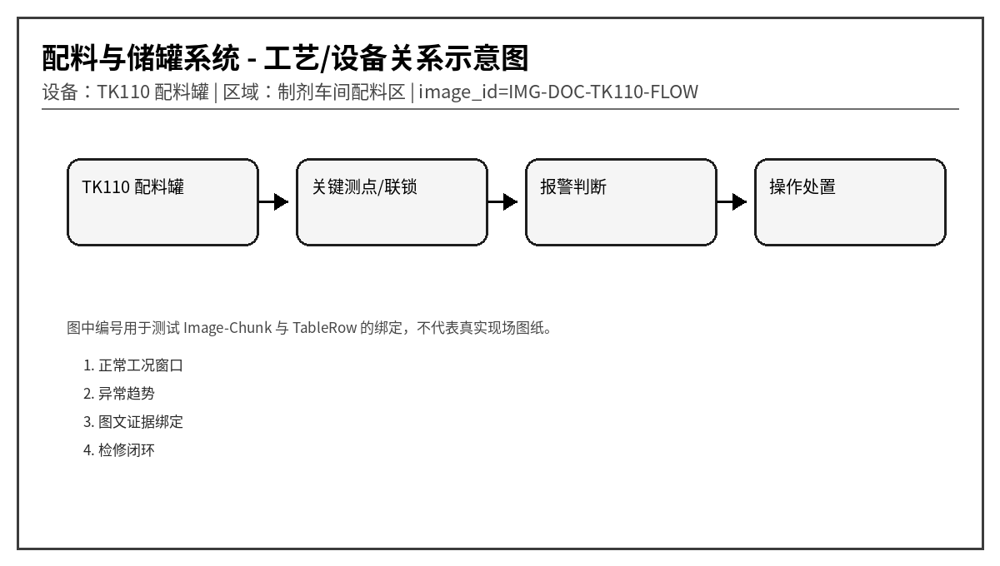
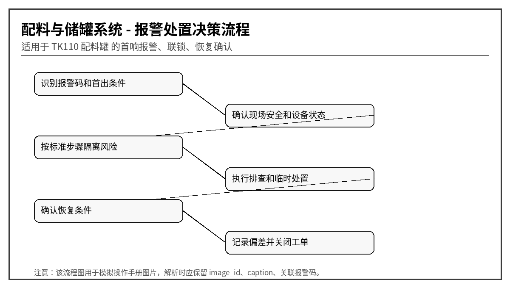

# TK110 配料罐液位、称量与 CIP 异常报警操作说明
文档编号：DOC-TK110  
版本：V1.0-模拟语料  
系统：配料与储罐系统  
设备：TK110 配料罐  
区域：制剂车间配料区
> 说明：本文档为模拟语料，用于知识库 Agent、RAG、GraphRAG、表格解析、图片绑定和报警处置问答测试，不代表真实装置操作票。
## 1. 适用范围与系统边界
本文档模拟配料罐高低液位、阀门失败、泵干运转、称量偏差、搅拌过载、泡沫、配方不匹配、流量计和 CIP 状态异常。适合测试配方-步骤-报警-质量风险关系。

## 2. 正常运行窗口
| 位号 | 参数 | 单位 | 正常范围 | 说明 |
|---|---|---|---|---|
| TK110_LVL | 罐液位 | % | 15 ~ 85 | 高高禁止继续进料 |
| TK110_WT | 称重值 | kg | 按配方 | 偏差影响质量 |
| TK110_AGI | 搅拌电流 | A | < 额定 100% | 过载查粘度和机械 |
| TK110_FT | 进料流量 | L/min | 按阶段 20 ~ 80 | 脉冲丢失需停投 |
| TK110_CIP | CIP 状态 | 枚举 | 完成/未完成 | 未完成禁止投料 |

## 3. 报警总览表
| alarm_code | 报警名称 | 等级 | 触发位号 | 触发条件 | 关联图片ID |
|---|---|---|---|---|---|
| TK110-A001 | 高高液位 | 高高 | TK110_LVL | 液位 > 92% 持续 5 s | HH |
| TK110-A002 | 低低液位 | 高 | TK110_LVL | 液位 < 8% 持续 10 s | LL |
| TK110-A003 | 进料阀关闭失败 | 高 | TK110_INV | 关闭命令后反馈仍开 | INV |
| TK110-A004 | 出料泵干运转 | 高 | TK110_PUMP | 泵运行且流量低/液位低 | DRY |
| TK110-A005 | 称量偏差大 | 中 | TK110_WT | 实际累计量偏离配方 > 1.5% | WT |
| TK110-A006 | 搅拌器过载 | 高 | TK110_AGI | 电流 > 额定 120% 持续 10 s | AGI |
| TK110-A007 | 泡沫检测报警 | 中 | TK110_FOAM | 泡沫探头动作超过 20 s | FOAM |
| TK110-A008 | 配方不匹配 | 高 | TK110_RECIPE | 当前物料/批号与配方不一致 | RECIPE |
| TK110-A009 | 流量计脉冲丢失 | 中 | TK110_FT | 阀开且泵运行但脉冲为 0 | FT |
| TK110-A010 | CIP 未完成 | 高 | TK110_CIP | CIP 状态未完成但请求投料 | CIP |

## 4. 逐项报警处置卡

### 4.1 TK110-A001 高高液位
- chunk_id：DOC-TK110-CH-001
- row_id：DOC-TK110-TALARM-R001
- 触发位号：TK110_LVL
- 触发条件：液位 > 92% 持续 5 s
- 严重等级：高高
- 关联图片：HH

**可能原因：**
1. 进料阀未关严
1. 液位计漂移
1. 配方量设置过大
1. 泡沫导致假液位

**标准操作步骤：**
1. 立即关闭所有进料阀
2. 停止上游泵
3. 核对现场液位和称重
4. 禁止继续投料

**恢复条件：** 液位 < 85% 且原因确认。

**GraphRAG 建议三元组：**
- (:Alarm {code:'TK110-A001'})-[:BELONGS_TO]->(:Device {name:'TK110 配料罐'})
- (:Alarm {code:'TK110-A001'})-[:HAS_ACTION]->(:Action {text:'立即关闭所有进料阀'})
- (:TableRow {row_id:'DOC-TK110-TALARM-R001'})-[:MENTIONS]->(:Alarm {code:'TK110-A001'})
- (:TableRow {row_id:'DOC-TK110-TALARM-R001'})-[:HAS_IMAGE]->(:Image {image_id:'HH'})

### 4.2 TK110-A002 低低液位
- chunk_id：DOC-TK110-CH-002
- row_id：DOC-TK110-TALARM-R002
- 触发位号：TK110_LVL
- 触发条件：液位 < 8% 持续 10 s
- 严重等级：高
- 关联图片：LL

**可能原因：**
1. 出料泵抽空
1. 液位计故障
1. 排放阀未关
1. 配方阶段未装料

**标准操作步骤：**
1. 停止出料泵防干运转
2. 检查排放阀
3. 核对称重值
4. 确认液位计状态

**恢复条件：** 液位 > 15%。

**GraphRAG 建议三元组：**
- (:Alarm {code:'TK110-A002'})-[:BELONGS_TO]->(:Device {name:'TK110 配料罐'})
- (:Alarm {code:'TK110-A002'})-[:HAS_ACTION]->(:Action {text:'停止出料泵防干运转'})
- (:TableRow {row_id:'DOC-TK110-TALARM-R002'})-[:MENTIONS]->(:Alarm {code:'TK110-A002'})
- (:TableRow {row_id:'DOC-TK110-TALARM-R002'})-[:HAS_IMAGE]->(:Image {image_id:'LL'})

### 4.3 TK110-A003 进料阀关闭失败
- chunk_id：DOC-TK110-CH-003
- row_id：DOC-TK110-TALARM-R003
- 触发位号：TK110_INV
- 触发条件：关闭命令后反馈仍开
- 严重等级：高
- 关联图片：INV

**可能原因：**
1. 气动阀卡涩
1. 电磁阀漏气
1. 反馈开关失准
1. 阀座有异物

**标准操作步骤：**
1. 关闭上游手阀
2. 停止对应进料泵
3. 检查阀门反馈
4. 必要时隔离该原料线

**恢复条件：** 阀门关闭反馈正常。

**GraphRAG 建议三元组：**
- (:Alarm {code:'TK110-A003'})-[:BELONGS_TO]->(:Device {name:'TK110 配料罐'})
- (:Alarm {code:'TK110-A003'})-[:HAS_ACTION]->(:Action {text:'关闭上游手阀'})
- (:TableRow {row_id:'DOC-TK110-TALARM-R003'})-[:MENTIONS]->(:Alarm {code:'TK110-A003'})
- (:TableRow {row_id:'DOC-TK110-TALARM-R003'})-[:HAS_IMAGE]->(:Image {image_id:'INV'})

### 4.4 TK110-A004 出料泵干运转
- chunk_id：DOC-TK110-CH-004
- row_id：DOC-TK110-TALARM-R004
- 触发位号：TK110_PUMP
- 触发条件：泵运行且流量低/液位低
- 严重等级：高
- 关联图片：DRY

**可能原因：**
1. 罐液位不足
1. 出口阀关闭
1. 泵未灌满
1. 流量计故障

**标准操作步骤：**
1. 立即停泵
2. 确认罐液位
3. 打开排气灌泵
4. 复位后点动试车

**恢复条件：** 泵有稳定流量且无异响。

**GraphRAG 建议三元组：**
- (:Alarm {code:'TK110-A004'})-[:BELONGS_TO]->(:Device {name:'TK110 配料罐'})
- (:Alarm {code:'TK110-A004'})-[:HAS_ACTION]->(:Action {text:'立即停泵'})
- (:TableRow {row_id:'DOC-TK110-TALARM-R004'})-[:MENTIONS]->(:Alarm {code:'TK110-A004'})
- (:TableRow {row_id:'DOC-TK110-TALARM-R004'})-[:HAS_IMAGE]->(:Image {image_id:'DRY'})

### 4.5 TK110-A005 称量偏差大
- chunk_id：DOC-TK110-CH-005
- row_id：DOC-TK110-TALARM-R005
- 触发位号：TK110_WT
- 触发条件：实际累计量偏离配方 > 1.5%
- 严重等级：中
- 关联图片：WT

**可能原因：**
1. 流量计系数错误
1. 阀门关闭滞后
1. 称重传感器漂移
1. 人工补料未录入

**标准操作步骤：**
1. 暂停批次进入 HOLD
2. 核对配方目标量
3. 复核称重零点
4. 由质量人员判定偏差处理

**恢复条件：** 偏差记录关闭。

**GraphRAG 建议三元组：**
- (:Alarm {code:'TK110-A005'})-[:BELONGS_TO]->(:Device {name:'TK110 配料罐'})
- (:Alarm {code:'TK110-A005'})-[:HAS_ACTION]->(:Action {text:'暂停批次进入 HOLD'})
- (:TableRow {row_id:'DOC-TK110-TALARM-R005'})-[:MENTIONS]->(:Alarm {code:'TK110-A005'})
- (:TableRow {row_id:'DOC-TK110-TALARM-R005'})-[:HAS_IMAGE]->(:Image {image_id:'WT'})

### 4.6 TK110-A006 搅拌器过载
- chunk_id：DOC-TK110-CH-006
- row_id：DOC-TK110-TALARM-R006
- 触发位号：TK110_AGI
- 触发条件：电流 > 额定 120% 持续 10 s
- 严重等级：高
- 关联图片：AGI

**可能原因：**
1. 物料粘度过高
1. 叶轮被异物卡住
1. 液位过低造成搅拌不稳定
1. 减速机故障

**标准操作步骤：**
1. 停止加料并降低搅拌转速
2. 检查罐内异常声
3. 确认液位和粘度
4. 必要时停机检修

**恢复条件：** 电流恢复正常。

**GraphRAG 建议三元组：**
- (:Alarm {code:'TK110-A006'})-[:BELONGS_TO]->(:Device {name:'TK110 配料罐'})
- (:Alarm {code:'TK110-A006'})-[:HAS_ACTION]->(:Action {text:'停止加料并降低搅拌转速'})
- (:TableRow {row_id:'DOC-TK110-TALARM-R006'})-[:MENTIONS]->(:Alarm {code:'TK110-A006'})
- (:TableRow {row_id:'DOC-TK110-TALARM-R006'})-[:HAS_IMAGE]->(:Image {image_id:'AGI'})

### 4.7 TK110-A007 泡沫检测报警
- chunk_id：DOC-TK110-CH-007
- row_id：DOC-TK110-TALARM-R007
- 触发位号：TK110_FOAM
- 触发条件：泡沫探头动作超过 20 s
- 严重等级：中
- 关联图片：FOAM

**可能原因：**
1. 进料速度过快
1. 消泡剂不足
1. 配方温度不合适
1. 探头挂料

**标准操作步骤：**
1. 降低进料速度
2. 按规程加入消泡剂
3. 检查温度和搅拌速度
4. 清洁泡沫探头

**恢复条件：** 泡沫探头复位且液位可信。

**GraphRAG 建议三元组：**
- (:Alarm {code:'TK110-A007'})-[:BELONGS_TO]->(:Device {name:'TK110 配料罐'})
- (:Alarm {code:'TK110-A007'})-[:HAS_ACTION]->(:Action {text:'降低进料速度'})
- (:TableRow {row_id:'DOC-TK110-TALARM-R007'})-[:MENTIONS]->(:Alarm {code:'TK110-A007'})
- (:TableRow {row_id:'DOC-TK110-TALARM-R007'})-[:HAS_IMAGE]->(:Image {image_id:'FOAM'})

### 4.8 TK110-A008 配方不匹配
- chunk_id：DOC-TK110-CH-008
- row_id：DOC-TK110-TALARM-R008
- 触发位号：TK110_RECIPE
- 触发条件：当前物料/批号与配方不一致
- 严重等级：高
- 关联图片：RECIPE

**可能原因：**
1. 扫码错误
1. MES 下发版本过旧
1. 人工选择错误配方
1. 物料标签污染

**标准操作步骤：**
1. 立即停止投料
2. 核对 MES 配方版本
3. 通知质量复核物料
4. 错误物料不得混入

**恢复条件：** 配方和物料复核通过。

**GraphRAG 建议三元组：**
- (:Alarm {code:'TK110-A008'})-[:BELONGS_TO]->(:Device {name:'TK110 配料罐'})
- (:Alarm {code:'TK110-A008'})-[:HAS_ACTION]->(:Action {text:'立即停止投料'})
- (:TableRow {row_id:'DOC-TK110-TALARM-R008'})-[:MENTIONS]->(:Alarm {code:'TK110-A008'})
- (:TableRow {row_id:'DOC-TK110-TALARM-R008'})-[:HAS_IMAGE]->(:Image {image_id:'RECIPE'})

### 4.9 TK110-A009 流量计脉冲丢失
- chunk_id：DOC-TK110-CH-009
- row_id：DOC-TK110-TALARM-R009
- 触发位号：TK110_FT
- 触发条件：阀开且泵运行但脉冲为 0
- 严重等级：中
- 关联图片：FT

**可能原因：**
1. 流量计卡死
1. 线缆断线
1. 小流量低于下限
1. 脉冲输入模块故障

**标准操作步骤：**
1. 暂停对应投料
2. 检查现场流量
3. 测量脉冲信号
4. 切换备用计量方式需审批

**恢复条件：** 脉冲恢复或备用计量确认。

**GraphRAG 建议三元组：**
- (:Alarm {code:'TK110-A009'})-[:BELONGS_TO]->(:Device {name:'TK110 配料罐'})
- (:Alarm {code:'TK110-A009'})-[:HAS_ACTION]->(:Action {text:'暂停对应投料'})
- (:TableRow {row_id:'DOC-TK110-TALARM-R009'})-[:MENTIONS]->(:Alarm {code:'TK110-A009'})
- (:TableRow {row_id:'DOC-TK110-TALARM-R009'})-[:HAS_IMAGE]->(:Image {image_id:'FT'})

### 4.10 TK110-A010 CIP 未完成
- chunk_id：DOC-TK110-CH-010
- row_id：DOC-TK110-TALARM-R010
- 触发位号：TK110_CIP
- 触发条件：CIP 状态未完成但请求投料
- 严重等级：高
- 关联图片：CIP

**可能原因：**
1. 清洗步骤中断
1. 电导率未达标
1. 操作员误跳步
1. CIP 记录未回传

**标准操作步骤：**
1. 禁止投料
2. 查看 CIP 步骤记录
3. 完成补洗或重新清洗
4. 质量确认后解除

**恢复条件：** CIP 完成且 QA 放行。

**GraphRAG 建议三元组：**
- (:Alarm {code:'TK110-A010'})-[:BELONGS_TO]->(:Device {name:'TK110 配料罐'})
- (:Alarm {code:'TK110-A010'})-[:HAS_ACTION]->(:Action {text:'禁止投料'})
- (:TableRow {row_id:'DOC-TK110-TALARM-R010'})-[:MENTIONS]->(:Alarm {code:'TK110-A010'})
- (:TableRow {row_id:'DOC-TK110-TALARM-R010'})-[:HAS_IMAGE]->(:Image {image_id:'CIP'})

## 5. 易混淆报警与反例
- 同样是“压力高”，若伴随电流高，优先考虑负荷/阀位；若就地表正常而 DCS 偏高，优先考虑仪表导压或传感器。
- 同样是“振动高”，若吸入口压力低或流量波动，优先考虑汽蚀；若 1X 转频主导，优先考虑不平衡；若高频包络谱特征明显，优先考虑轴承故障。
- 对于高高联锁报警，回答中必须体现“先确认安全，再恢复生产”，不能只给重启步骤。

## 6. 班组交接记录模板
| 时间 | 报警码 | 首出/伴随报警 | 已执行操作 | 当前状态 | 交接人 |
|---|---|---|---|---|---|
| 2026-05-28 09:10 | 示例 | 示例 | 示例 | 示例 | 示例 |
